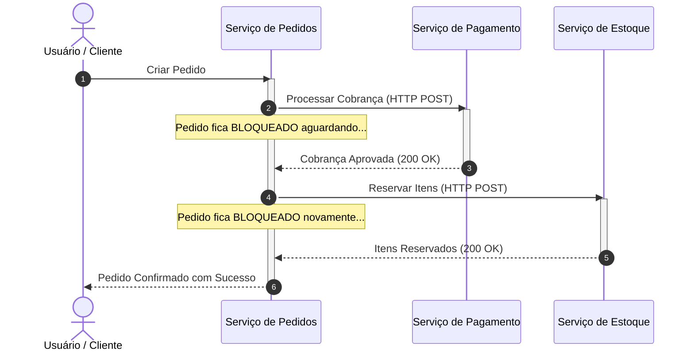
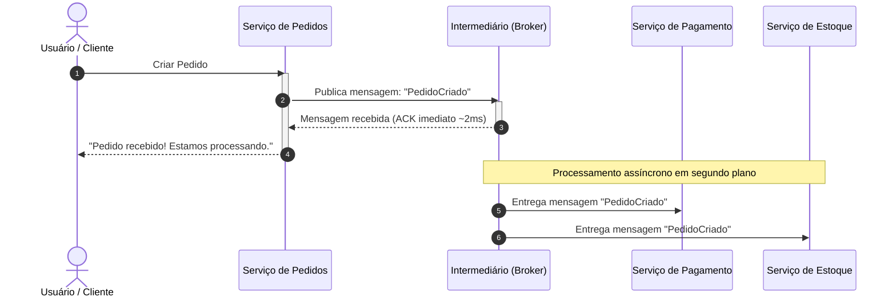
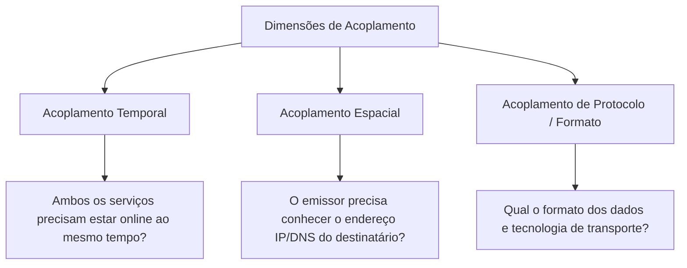
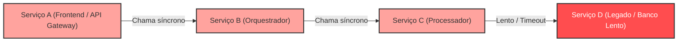

# Módulo 01: Fundamentos da Comunicação em Sistemas Distribuídos

> [!NOTE]
> Este módulo aborda as raízes de sistemas distribuídos: como componentes se comunicam através da rede, as diferenças vitais entre comunicação síncrona e assíncrona, e os diferentes tipos de acoplamento entre serviços.

---

## 1. O Desafio da Comunicação Distribuída

Em uma aplicação monolítica rodando em um único processo, a comunicação entre módulos ocorre via **chamadas de métodos em memória** (chamadas de função):
- A latência é na ordem de nanossegundos.
- A taxa de transferência é limitada apenas pelo barramento de memória e CPU.
- O destino sempre existe (a menos que a JVM/runtime inteiro entre em colapso).

Quando dividimos um sistema em múltiplos nós (microsserviços, serviços em nuvem, integrações de terceiros), essa comunicação passa a ocorrer pela **rede física**. Surgem então as clássicas **8 Falácias da Computação Distribuída** (Peter Deutsch):
1. A rede é confiável.
2. A latência é zero.
3. A largura de banda é infinita.
4. A rede é segura.
5. A topologia não muda.
6. Há apenas um administrador.
7. O custo de transporte é zero.
8. A rede é homogênea.

A mensageria nasce diretamente da necessidade de mitigar e conviver de forma elegante com essas 8 falácias.

---

## 2. Comunicação Síncrona vs Assíncrona

A distinção entre síncrono e assíncrono é uma das mais importantes da arquitetura de software, e frequentemente é confundida entre dois níveis: **nível de thread/código** e **nível de arquitetura/sistema**.

### 2.1. Nível de Sistema: Síncrono (Request-Response)

No modelo síncrono no nível de arquitetura, o serviço emissor (Cliente) envia uma requisição ao serviço receptor (Servidor) e **precisa da resposta imediata** para concluir seu fluxo de negócio. O fluxo do emissor depende ativamente do resultado gerado pelo receptor naquele mesmo instante.

#### Características da Comunicação Síncrona:
- **Expectativa de retorno imediato:** O cliente não pode seguir adiante sem a resposta.
- **Soma das Latências:** Se o serviço de Pagamento demora 250ms e o de Estoque demora 350ms, o tempo de resposta mínimo percebido pelo usuário é $250 + 350 = 600\text{ ms}$, mais a latência de rede.
- **Disponibilidade Multiplicativa:** Se cada serviço tem $99.9\%$ de disponibilidade ($A$), a disponibilidade da operação é $A_{total} = A_{Pedido} \times A_{Pagamento} \times A_{Estoque} = 0.999 \times 0.999 \times 0.999 \approx 99.7\%$.

### 2.2. Nível de Sistema: Assíncrono (Fire-and-Forget / Notificação)

No modelo assíncrono, o serviço emissor envia uma mensagem ou registra uma intenção e **não fica aguardando o processamento final** do destinatário para continuar sua vida ou responder ao usuário. O processamento ocorrerá em momento oportuno no futuro.

---

## 3. As Dimensões do Acoplamento

O acoplamento mede o grau de interdependência entre componentes de software. Em sistemas distribuídos, existem três dimensões críticas de acoplamento:

### 3.1. Acoplamento Temporal
- **Comunicação Síncrona (Alto Acoplamento Temporal):** O emissor e o receptor devem estar disponíveis no exato momento da chamada. Se o receptor estiver fora do ar ou reiniciar, a chamada falha instantaneamente.
- **Mensageria (Desacoplamento Temporal):** O emissor pode publicar a mensagem às 14:00. O consumidor pode estar desligado, em manutenção ou sobrecarregado, e iniciar o processamento somente às 14:30. A mensagem permanece segura e persistida no broker.

### 3.2. Acoplamento Espacial (Localização / Identidade)
- **Comunicação Direta (Alto Acoplamento Espacial):** O emissor precisa saber o endereço de rede (IP, porta, URL, DNS) do receptor específico. Ex.: `https://api.pagamentos.interno/v1/charge`.
- **Mensageria (Desacoplamento Espacial):** O emissor conhece apenas o canal ou tópico (ex.: `pedidos.criados`). Ele não faz ideia de quantos consumidores existem, quem são, onde estão hospedados ou em que linguagem foram escritos.

### 3.3. Acoplamento de Protocolo e Interface
- Define como as partes concordam com o formato das informações (JSON, Protobuf, Avro, XML) e as regras do contrato de dados. Em ambos os modelos é necessário um contrato estável, mas a mensageria costuma favorecer a evolução independente de esquemas (schema evolution).

---

## 4. O Efeito Dominó: Falhas em Cascata (Cascading Failures)

Em uma malha de serviços altamente síncrona baseada em chamadas HTTP/REST diretas, uma degradação em um serviço folha pode derrubar todo o sistema:

### Mecanismo do desastre:
1. O **Serviço D** fica lento devido a um lock de banco de dados ou pico de tráfego.
2. As conexões abertas do **Serviço C** aguardando resposta de D começam a se acumular. O pool de threads/conexões de C esgota.
3. O **Serviço B** aguarda C, esgotando também suas próprias threads de processamento.
4. O **Serviço A** não consegue mais atender os usuários finais porque todas as suas threads de requisição estão bloqueadas aguardando B.
5. **Resultado:** Todo o sistema para de responder, mesmo para operações que não dependiam diretamente de D.

> [!WARNING]
> Em chamadas síncronas em cadeia, a tolerância a falhas exige mecanismos complexos de mitigação como *Circuit Breakers*, *Timeouts* curtos e *Bulkheads*. A mensageria atua como um amortecedor natural para esse problema.

---

## 5. Tabela Comparativa: Síncrono vs Assíncrono

| Critério | Comunicação Síncrona (ex.: HTTP REST, gRPC) | Comunicação Assíncrona (via Mensageria) |
| :--- | :--- | :--- |
| **Tempo de Resposta** | Bloqueia até a conclusão do processamento. | Não bloqueia; responde assim que a mensagem é acolhida. |
| **Disponibilidade Requerida** | Ambos os serviços devem estar online simultaneamente. | O consumidor pode estar offline temporariamente. |
| **Acoplamento** | Alto (temporal e espacial). | Baixo (desacoplado em tempo e espaço). |
| **Complexidade Operacional** | Baixa inicial (apenas cliente e servidor). | Média/Alta (necessidade de gerenciar um Message Broker). |
| **Garantia de Leitura** | Imediata (resposta direta no HTTP response). | Eventual (consistência eventual, leitura após consumo). |
| **Nivelamento de Picos** | Frágil: picos podem derrubar o servidor por sobrecarga. | Excelente: mensagens acumulam na fila e são drenadas no ritmo do consumidor. |
| **Cenário Ideal** | Consultas imediatas (queries), leitura de dados, autenticação de sessão. | Notificações de eventos, processamento de pagamentos, relatórios pesados, integrações multi-sistema. |

---

## 🎯 Perguntas para Autoavaliação e Fixação

1. *Por que a latência de uma cadeia de 4 serviços síncronos é acumulativa, enquanto na mensageria ela não afeta o tempo de resposta do cliente?*
2. *O que significa dizer que a mensageria promove "desacoplamento temporal"? Dê um exemplo prático.*
3. *Se um serviço precisa exibir para o usuário o saldo bancário atualizado em tempo real na tela, a comunicação síncrona ou assíncrona é a escolha primária natural? Por quê?*
4. *Como o esgotamento do pool de threads em chamadas síncronas bloqueantes pode originar uma falha em cascata?*

---

⬅️ [Voltar ao Índice Principal](../README.md) | ➡️ [Avançar para o Módulo 02: O Que é Mensageria](../02-o-que-e-mensageria/README.md)
