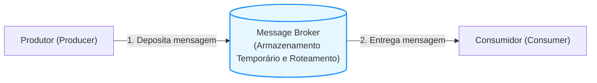
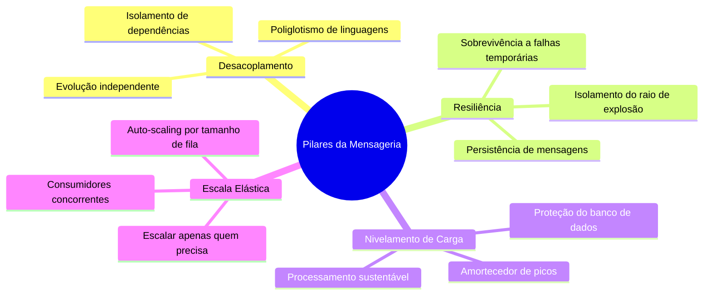
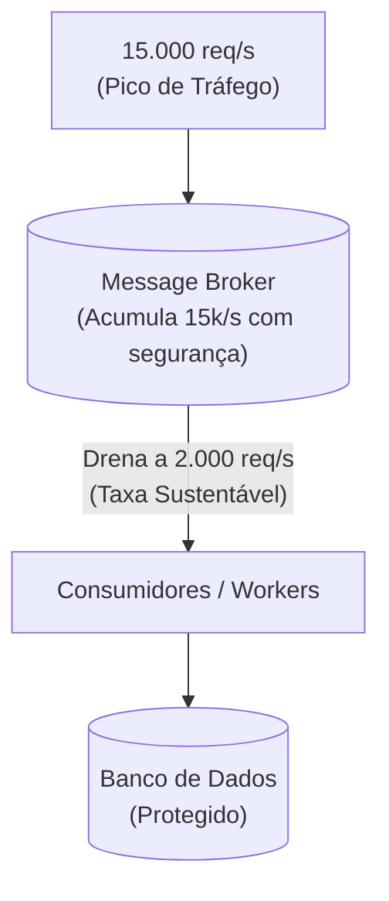
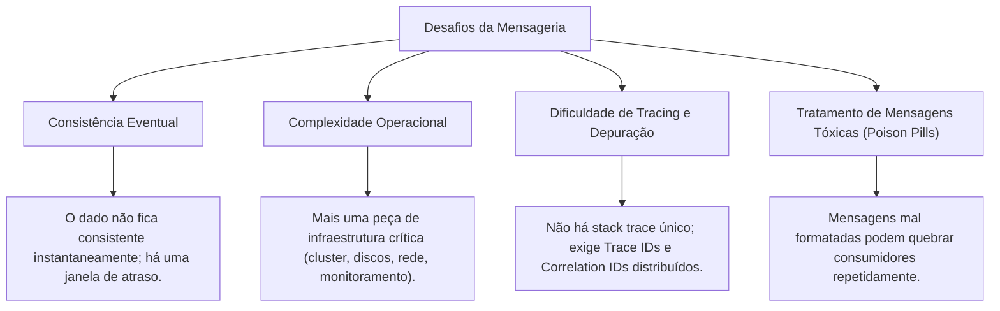
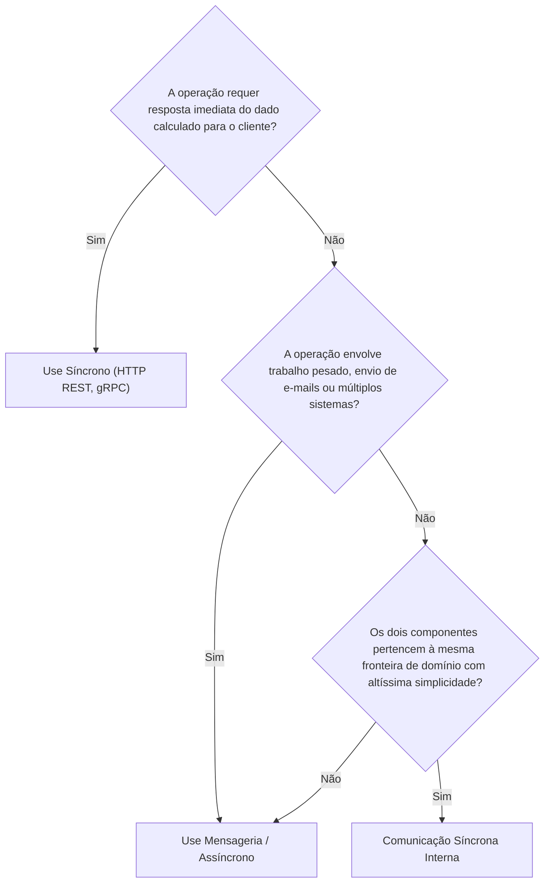

# Módulo 02: O Que é Mensageria e Sua Importância

> [!NOTE]
> Este módulo aprofunda a definição conceitual de mensageria (*Message-Oriented Middleware*), explora os 4 pilares fundamentais de valor que justificam sua adoção e analisa os trade-offs e custos operacionais envolvidos.

---

## 1. O Que é Mensageria?

Em termos conceituais e formais, **Mensageria** é um paradigma de comunicação em que componentes ou serviços de software trocam dados transmitindo pacotes autocontidos de informação chamados **mensagens**, de forma intermediada e tipicamente assíncrona.

O elemento central desse modelo é o **MOM** (*Message-Oriented Middleware*), popularmente conhecido como **Message Broker** (Corretor de Mensagens) ou Barramento de Mensagens.

### A Analogia do Sistema Postal (Correios)
Pense na comunicação síncrona como uma **ligação telefônica**: você disca e precisa que a outra pessoa atenda imediatamente para falar. Se a pessoa estiver ocupada ou dormindo, a comunicação falha.

A mensageria funciona como uma **carta enviada pelos Correios**:
1. Você escreve a carta, coloca no envelope com o endereço de destino (metadados) e deposita na caixa de coleta da agência postal.
2. A sua responsabilidade imediata terminou ali; você volta para suas outras atividades.
3. Os correios armazenam, roteiam e transportam a carta com segurança.
4. O destinatário recolhe a correspondência em sua caixa de correio quando puder, lê e toma as providências necessárias.

---

## 2. Por que Usar Mensageria? Os 4 Pilares de Valor

A adoção de mensageria não é uma mera escolha estilística de código; trata-se de uma decisão de infraestrutura e arquitetura que resolve problemas críticos de escala e robustez.

### Pilar 1: Desacoplamento Radical
- **Desacoplamento de Código e Ciclo de Vida:** O Produtor e o Consumidor não compartilham código, processos, nem precisam ser reiniciados ou atualizados juntos.
- **Desacoplamento Tecnológico (Poliglotismo):** O emissor pode ser escrito em Go, o broker gerenciar o tráfego via protocolo padronizado (AMQP, MQTT ou HTTP/Kafka), e o consumidor ser um worker em Python ou Java.

### Pilar 2: Resiliência e Tolerância a Falhas
Em integrações síncronas diretas, se o serviço B cai, o serviço A falha em cascata. Com mensageria:
- Se o consumidor cair ou for reiniciado por deploys, o produtor **continua funcionando normalmente**.
- As mensagens não são perdidas; ficam retidas no broker, aguardando que o consumidor se recupere para serem processadas.
- O chamado **raio de explosão** (*blast radius*) de um incidente é contido.

### Pilar 3: Nivelamento de Carga (*Load Leveling / Traffic Smoothing*)
Imagine uma loja virtual durante a **Black Friday**:
- Às 00:00, o tráfego de novos pedidos salta de 100 pedidos por segundo para **15.000 pedidos por segundo**.
- Se a gravação de pedidos chamar diretamente o banco de dados e APIs fiscais síncronas, o banco sofrerá exaustão de conexões e cairá.
- Com mensageria, o broker atua como uma represa amortecedora (*buffer*):

> [!TIP]
> O nivelamento de carga protege sistemas sensíveis (como bancos de dados relacionais ou serviços legados) de serem esmagados por surtos repentinos de requisições.

### Pilar 4: Escalabilidade Elástica e Independente
- Se a fila de "emissão de notas fiscais" estiver crescendo mais rápido do que é consumida, você pode instanciar mais réplicas de workers consumidores daquela fila específica.
- Não é necessário escalar a aplicação inteira, apenas o componente gargalo.
- Muitas plataformas de orquestração (como Kubernetes via KEDA) usam o tamanho da fila (*queue depth* ou *consumer lag*) como métrica para disparar o auto-scaling de pods.

---

## 3. Os Desafios e Custos da Mensageria (Trade-offs)

Nenhuma decisão de engenharia vem sem custos. Mensageria adiciona camadas de complexidade que devem ser geridas:

### 1. Adeus às Transações ACID Distribuídas
Em sistemas síncronos tradicionais com banco único, você podia abrir uma transação (`BEGIN TRANSACTION`), alterar três tabelas e fazer `COMMIT`.
Com mensageria e múltiplos serviços, cada serviço tem seu próprio banco de dados. A consistência passa a ser **eventual** (*Eventual Consistency*). Durante frações de segundo (ou minutos), o estado do sistema pode parecer incoerente para o observador externo.

### 2. Rastreabilidade e Observabilidade Complexa
Quando uma exceção ocorre dentro de um worker consumidor, a requisição HTTP original do cliente já encerrou há minutos. Para entender o que aconteceu de ponta a ponta, é mandatório propagar metadados de observabilidade (*Correlation ID*, *Trace ID* via OpenTelemetry).

### 3. Falhas Silenciosas e "Poison Pills"
Se uma mensagem possui um payload com formato inesperado que lança uma exceção não tratada no consumidor, o consumidor pode tentar ler a mensagem, falhar, reinserir na fila e falhar novamente em loop infinito (*poison message*), travando a fila se não houver mecanismos adequados de descarte e reenvio.

---

## 4. Matriz de Decisão: Quando Usar vs Quando Evitar

### ✅ Cenários Ideais para Mensageria:
- **Processamento em segundo plano:** Geração de relatórios, conversão de vídeos, envio de notificações/e-mails.
- **Integração entre múltiplos domínios de negócio:** Notificar faturamento, estoque e logística quando um pedido é pago.
- **Cargas de alta volatilidade com picos imprevisíveis:** Webhooks de gateways de pagamento, campanhas promocionais.
- **Sistemas com disponibilidade heterogênea:** Conexão com sistemas bancários legados que sofrem janelas de indisponibilidade programada.

### ❌ Cenários Onde Mensageria Traz Complexidade Desnecessária:
- **Consultas diretas de leitura (Queries):** Buscar detalhes do perfil de um usuário ou CEP na tela de checkout.
- **Autenticação e Autorização em tempo real:** Validar um token JWT antes de permitir o acesso a uma rota.
- **Sistemas pequenos e monolíticos:** Onde uma fila simples em memória (*in-memory job queue* do próprio framework) resolve o problema sem custo de gerenciar um broker.

---

## 🎯 Perguntas para Autoavaliação e Fixação

1. *Explique o conceito de "nivelamento de carga" (load leveling). Como ele protege um banco de dados relacional durante picos de acesso?*
2. *Quais são os 4 principais pilares de valor que a mensageria introduz em um sistema?*
3. *O que é uma "poison pill" (ou mensagem tóxica) em um cenário de mensageria e qual impacto ela pode causar se não for tratada?*
4. *Cite um exemplo de caso de uso onde a utilização de mensageria seria prejudicial ou desnecessária.*

---

⬅️ [Módulo 01: Fundamentos da Comunicação](../01-fundamentos-da-comunicacao/README.md) | ➡️ [Módulo 03: Mensagens, Eventos e Comandos](../03-mensagens-eventos-e-comandos/README.md)
