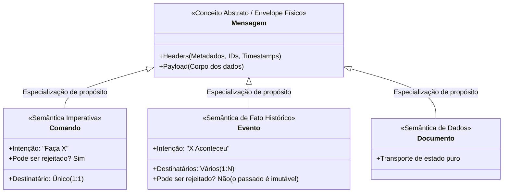
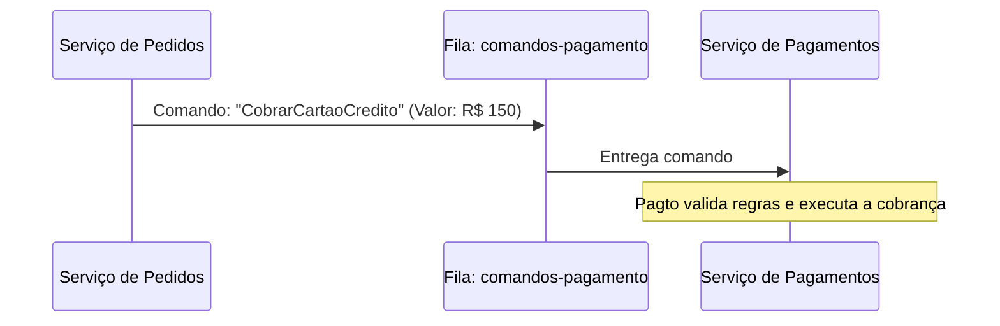
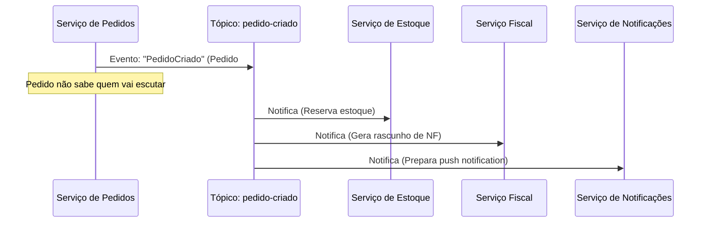
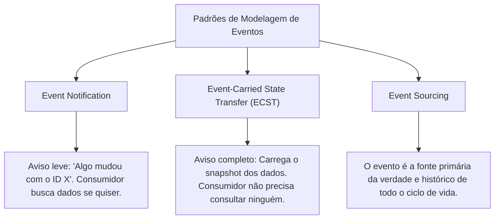

# Módulo 03: Mensagens, Eventos e Comandos

> [!IMPORTANT]
> Um dos erros mais comuns na engenharia de software é tratar "mensagem", "evento" e "comando" como sinônimos intercambiáveis. Compreender a diferença semântica entre esses três conceitos é o alicerce para projetar sistemas verdadeiramente desacoplados e resilientes.

---

## 1. A Taxonomia da Informação em Trânsito

Para construir clareza mental, veja a relação hierárquica entre esses termos:



Em resumo: **Toda informação que trafega em um Message Broker é tecnicamente uma Mensagem (o envelope). Porém, o propósito de negócio contido no payload determina se ela é um Comando ou um Evento.**

---

## 2. O Que é um Comando? (Semântica Imperativa)

Um **Comando** expressa uma ordem, solicitação ou intenção direta para que um sistema execute uma ação específica.

### Características do Comando:
- **Nomeclatura no Imperativo:** `EmitirNotaFiscal`, `ProcessarCobranca`, `CancelarAssinatura`, `EnviarEmailConfirmacao`.
- **Relação 1 para 1:** Geralmente possui um destinatário muito bem definido (o único serviço com autoridade para executar aquela ação).
- **Pode falhar ou ser rejeitado:** O destinatário pode validar regras de negócio e recusar a execução (ex.: saldo insuficiente, dados inválidos).
- **Acoplamento de Intenção:** O emissor conhece a competência do receptor e diz exatamente o que ele deve fazer.



---

## 3. O Que é um Evento? (Semântica de Fato Passado)

Um **Evento** é o registro imutável de que algo relevante para o negócio **acabou de acontecer**.

### Características do Evento:
- **Nomeclatura no Passado / Particípio:** `PedidoCriado`, `PagamentoAprovado`, `ItemDespachado`, `UsuarioRegistrado`.
- **Relação 1 para N (Broadcast):** O emissor apenas anuncia o fato para o mundo. Ele não sabe e não se importa com quem ou quantos serviços estão escutando.
- **Imutabilidade e Não-rejeição:** Um evento **não pode ser cancelado ou rejeitado** pelo consumidor. O fato histórico já aconteceu! O consumidor pode apenas reagir àquele fato (ou ignorá-lo).
- **Desacoplamento Semântico Total:** O emissor não comanda ninguém; ele apenas relata sua própria realidade.



---

## 4. Tabela Comparativa: Comando vs Evento

| Dimensão | Comando (*Command*) | Evento (*Event*) |
| :--- | :--- | :--- |
| **Tempo Verbal** | Imperativo (`CobrarCliente`) | Passado (`ClienteCobrado`) |
| **Intenção** | Solicita uma ação futura | Notifica um fato consumado |
| **Destinatários** | Exatamente um processador alvo (1:1) | Zero, um ou múltiplos observadores (1:N) |
| **Controle e Autoridade** | O emissor dita o que deve ser feito | O emissor relata o que fez; receptores decidem sua reação |
| **Pode ser recusado?** | **Sim.** Regras de negócio podem rejeitar o comando | **Não.** O fato já aconteceu no mundo real |
| **Padrão de Canal mais comum** | Filas Ponto a Ponto (*Point-to-Point Queue*) | Tópicos de Assinatura (*Pub/Sub Topic*) |

---

## 5. Padrões de Eventos (Segundo Martin Fowler)

Nem todos os eventos são modelados da mesma forma. Existem padrões clássicos fundamentais que você encontrará no mercado:



### 5.1. Notificação de Evento (*Event Notification*)
O evento contém apenas o mínimo necessário para avisar sobre a ocorrência:
```json
{
  "eventId": "evt-789a-4bc1",
  "eventType": "PedidoCriado",
  "timestamp": "2026-10-07T16:15:00Z",
  "aggregateId": "ped-10492"
}
```
- **Vantagem:** Payload minúsculo, tráfego de rede ínfimo, não expõe detalhes de schema internos.
- **Desvantagem:** Se o consumidor precisar saber o valor ou itens do pedido, terá que fazer uma chamada síncrona HTTP/gRPC de volta para o Serviço de Pedidos, reintroduzindo acoplamento temporal e tráfego na API.

### 5.2. Transferência de Estado Carregada por Evento (*Event-Carried State Transfer - ECST*)
O evento carrega consigo todos os dados relevantes do estado modificado:
```json
{
  "eventId": "evt-789a-4bc1",
  "eventType": "PedidoCriado",
  "timestamp": "2026-10-07T16:15:00Z",
  "pedidoId": "ped-10492",
  "cliente": {
    "id": "cli-551",
    "email": "maria@exemplo.com",
    "nome": "Maria Silva"
  },
  "itens": [
    { "sku": "NOTEBOOK-PRO-16", "quantidade": 1, "preco": 8500.00 }
  ],
  "total": 8500.00
}
```
- **Vantagem:** O consumidor possui todas as informações necessárias para trabalhar sem nunca precisar consultar o serviço de pedidos. Permite criar réplicas locais de leitura (*read projections*).
- **Desvantagem:** Payloads maiores; risco de expor contratos internos e maior complexidade no versionamento dos esquemas de dados.

### 5.3. Event Sourcing
No desenvolvimento tradicional, armazenamos o **estado atual** da entidade no banco de dados (ex.: tabela `Pedidos` com status `PAGO`).
No **Event Sourcing**, o estado atual nunca é gravado como uma linha mutável; a aplicação armazena **a sequência ordenada de todos os eventos que ocorreram** desde o nascimento da entidade:
1. `PedidoIniciado` (+ itens)
2. `CupomDescontoAplicado` (- R$ 50)
3. `EnderecoEntregaDefinido` (Rua X)
4. `PagamentoAprovado` (Cartão)

Para saber o saldo ou estado atual, você reproduz (*replays*) os eventos do início ao fim.

---

## 6. O Que é Arquitetura Orientada a Eventos (EDA)?

**Event-Driven Architecture (EDA)** é um estilo arquitetural de software no qual a captura, comunicação, processamento e persistência de eventos constituem a estrutura central do sistema.

### Princípios de um Sistema Orientado a Eventos:
1. **Reatividade:** O sistema reage a acontecimentos em tempo quase-real.
2. **Inversão de Dependência Arquitetural:** O produtor não sabe quem o consome. Se um novo subsistema (ex.: Machine Learning para detecção de fraudes) for criado amanhã, basta ele se inscrever no tópico `PedidoCriado`. O serviço de pedidos original não precisa ser alterado nem testado novamente!

---

## 🎯 Perguntas para Autoavaliação e Fixação

1. *Diga se a seguinte mensagem é um Comando ou um Evento e justifique: `EnviarEmailRedefinicaoSenha`.*
2. *Diga se a seguinte mensagem é um Comando ou um Evento e justifique: `TransacaoPixEfetivada`.*
3. *Por que um evento não pode ser "rejeitado" por um consumidor? Se o consumidor não conseguir lidar com o evento, o que isso significa em termos de negócio?*
4. *Qual é o principal benefício do padrão Event-Carried State Transfer (ECST) sobre o Event Notification tradicional? Qual o trade-off gerado?*

---

⬅️ [Módulo 02: O Que é Mensageria](../02-o-que-e-mensageria/README.md) | ➡️ [Módulo 04: Anatomia e Componentes](../04-anatomia-e-componentes/README.md)
