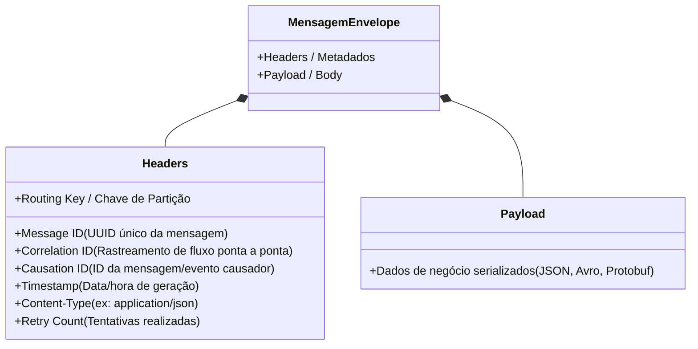
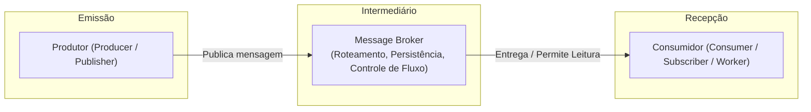
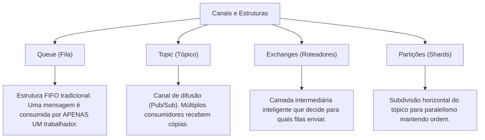
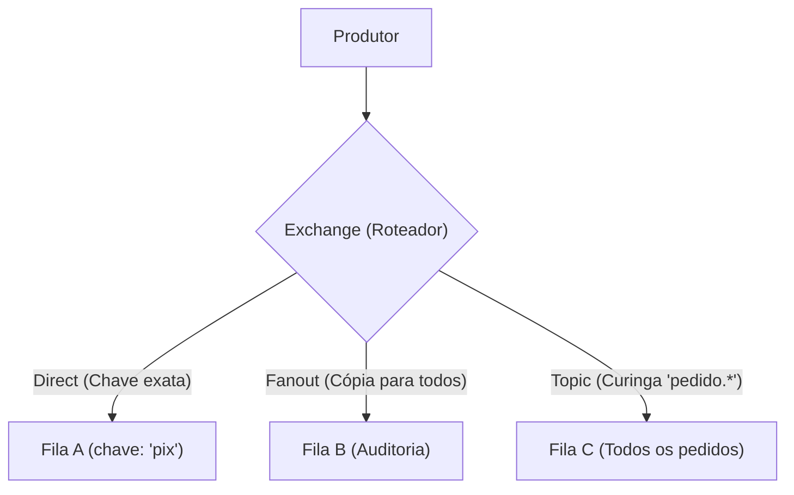
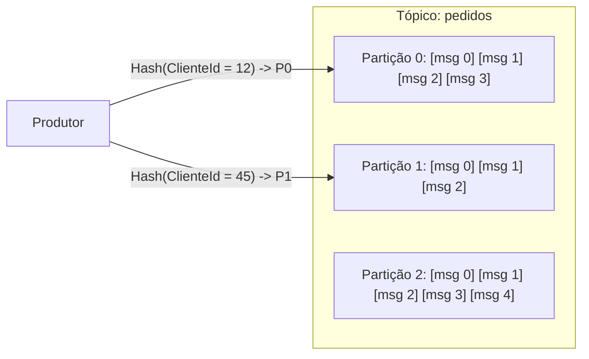
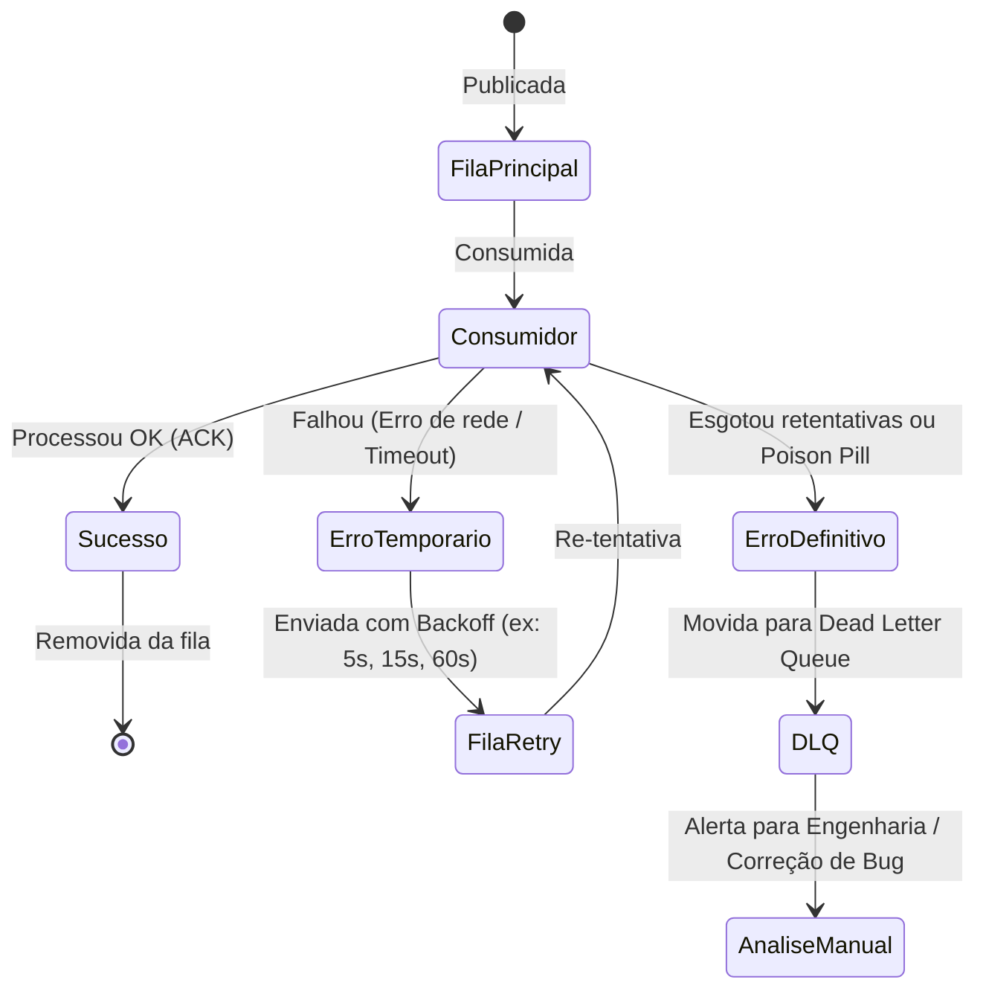

# Módulo 04: Anatomia e Componentes da Mensageria

> [!NOTE]
> Este módulo disseca as estruturas internas de uma mensagem, detalha as responsabilidades de cada ator envolvido e explica o papel de filas, tópicos, roteadores (*exchanges*), partições e filas de descarte (*Dead Letter Queues*).

---

## 1. A Anatomia de uma Mensagem

Uma mensagem em trânsito não é apenas uma sequência arbitrária de bytes. Ela é encapsulada em um envelope padronizado composto por duas partes principais: **Cabeçalhos (Headers)** e **Carga Útil (Payload)**.

### 1.1. Metadados Fundamentais nos Headers
- **Message ID:** Identificador universal único (UUID) desta mensagem específica.
- **Correlation ID:** Identificador global da operação comercial. Se o usuário disparou uma compra no carrinho, o mesmo `Correlation ID` é propagado pelo pedido, pagamento, estoque e nota fiscal, permitindo rastrear todo o caminho nos logs.
- **Causation ID:** O ID da mensagem diretamente anterior que desencadeou esta mensagem atual (cria a árvore genealógica do evento).
- **Timestamp:** Momento exato em que a mensagem foi gerada no emissor (essencial para detecção de latência de fila e ordenação).
- **Content-Type / Schema Version:** Informa como decodificar o payload (ex.: `application/json; version=2.1`).

---

## 2. Os Atores Principais

1. **Produtor (*Producer* ou *Publisher*):**
   - Cria o payload, preenche os metadados e despacha a mensagem para o broker.
   - Sua preocupação é apenas que o broker receba e armazene a mensagem com segurança (confirmação de publicação).
2. **Message Broker (O Intermediário):**
   - Servidor ou cluster responsável por aceitar conexões, autenticar, aplicar regras de roteamento, persistir em disco/memória e garantir a entrega aos destinos apropriados.
3. **Consumidor (*Consumer*, *Subscriber* ou *Worker*):**
   - Aplicação que se conecta ao broker, manifesta interesse em determinados canais, recebe mensagens, executa a lógica de negócio e notifica o broker se a operação foi bem-sucedida (*Acknowledgment*).

---

## 3. Estruturas de Armazenamento e Roteamento

Diferentes brokers organizam as mensagens utilizando conceitos que variam sutilmente, mas que compartilham fundamentos comuns:

### 3.1. Filas (*Queues*)
- Estrutura tradicional do tipo **FIFO** (*First-In, First-Out* - primeiro a entrar, primeiro a sair).
- **Semântica Ponto a Ponto (Point-to-Point):** Se uma mensagem entra na fila, apenas **um** consumidor a processará. Assim que processada e confirmada, ela é removida da fila.

### 3.2. Tópicos (*Topics*)
- Canal de publicação no modelo **Publicador/Assinante** (*Publish/Subscribe*).
- O produtor publica em um tópico. Múltiplos serviços com assinaturas ativas recebem, cada um, a sua cópia individual da mensagem.

### 3.3. Roteadores (*Exchanges* - Modelo AMQP / RabbitMQ)
No protocolo AMQP (usado pelo RabbitMQ), os produtores nunca publicam diretamente em uma fila! Eles publicam em uma **Exchange**, que analisa a chave de roteamento (*routing key*) e regras (*bindings*) para direcionar a mensagem:

- **Direct Exchange:** Encaminha a mensagem se a `routing_key` da mensagem for rigorosamente idêntica à `binding_key` da fila.
- **Fanout Exchange:** Ignora qualquer chave de roteamento e envia uma cópia da mensagem para **todas** as filas vinculadas a ela (broadcast puro).
- **Topic Exchange:** Faz correspondência por padrões de palavras separadas por ponto usando curingas:
  - `*` (asterisco): substitui exatamente uma palavra (ex.: `pedido.*.criado`).
  - `#` (cerquilha/hash): substitui zero ou mais palavras (ex.: `auditoria.#`).
- **Headers Exchange:** Roteia com base nos metadados do cabeçalho em vez da routing key.

### 3.4. Partições (*Partitions* - Modelo Log-Centric / Kafka)
Em plataformas como Apache Kafka e AWS Kinesis, um tópico não é uma fila única, mas um conjunto de **partições paralelas**:

- Cada partição é um log append-only ordenado e imutável.
- As mensagens recebem uma **Chave de Partição** (*Partition Key*). O broker aplica um hash na chave e direciona sempre mensagens da mesma chave para a mesma partição, **garantindo a ordem estrita por entidade** (ex.: todos os eventos do mesmo cliente caem na mesma partição).

---

## 4. O Ciclo de Vida do Tratamento de Falhas: DLQ e Retries

O que acontece quando o consumidor falha ao processar uma mensagem (ex.: timeout no banco, erro de formatação de dados)?

### 4.1. Dead Letter Queue (DLQ - Fila de Cartas Mortas)
- Uma **DLQ** é uma fila dedicada para isolar mensagens problemáticas que falharam repetidamente ou cujo tempo de vida expirou.
- **Objetivo da DLQ:** Evitar que uma mensagem com erro bloqueie a fila principal para as demais mensagens saudáveis (*poison message*), permitindo que a equipe de engenharia analise o erro, faça correções e reenvie as mensagens com segurança (*replay*).

### 4.2. Estratégia de Backoff Exponencial e Jitter
Quando uma mensagem falha devido a um erro transitório (ex.: instabilidade temporária na API de pagamento):
- Não se deve tentar novamente de forma imediata (isso causa um ataque de negação de serviço ao sistema degradado).
- Aplica-se **Backoff Exponencial**: 1ª tentativa em 2s, 2ª em 4s, 3ª em 8s, 4ª em 16s...
- Aplica-se **Jitter** (variação aleatória de milissegundos) para evitar que milhares de mensagens que falharam juntas tentem se reconectar no mesmo milissegundo.

### 4.3. Time-To-Live (TTL)
- Define a vida útil máxima de uma mensagem na fila.
- Se o consumidor estiver lento e o TTL expirar (ex.: uma mensagem de "Notificação de Trânsito em Tempo Real" perde o sentido após 10 minutos), o broker descarta ou redireciona a mensagem expirada para a DLQ.

---

## 🎯 Perguntas para Autoavaliação e Fixação

1. *Qual é a diferença fundamental entre um `Message ID` e um `Correlation ID`? Em que situações práticas você precisa de cada um?*
2. *Explique como funciona o roteamento por `Topic Exchange` no RabbitMQ com os curingas `*` e `#`.*
3. *Por que a estratégia de particionamento (sharding) é necessária para atingir alta taxa de transferência (throughput) mantendo a ordem das mensagens?*
4. *Qual é a função primordial de uma Dead Letter Queue (DLQ) na arquitetura de resiliência de um sistema?*

---

⬅️ [Módulo 03: Mensagens, Eventos e Comandos](../03-mensagens-eventos-e-comandos/README.md) | ➡️ [Módulo 05: Padrões de Mensageria](../05-padroes-de-mensageria/README.md)
