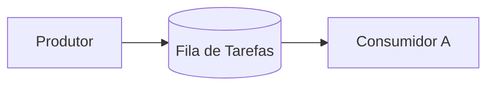
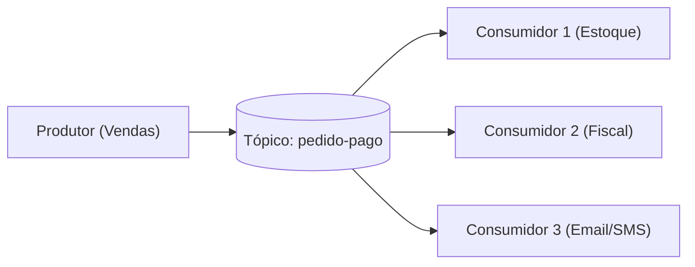
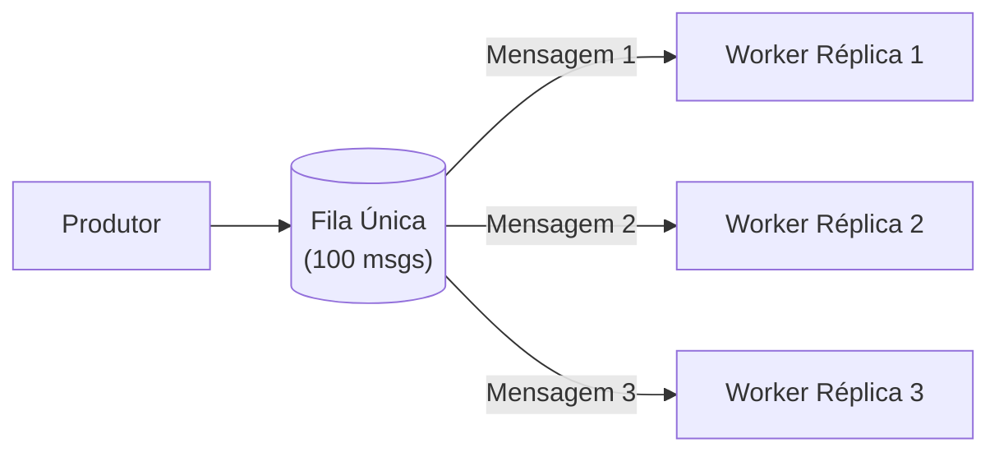
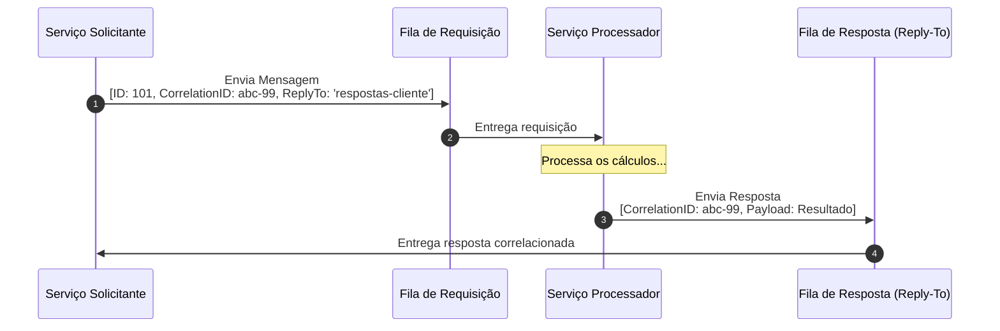
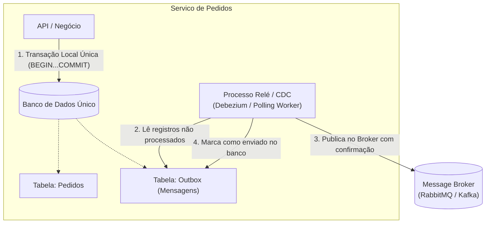
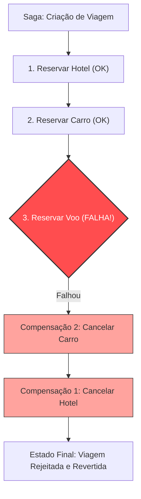
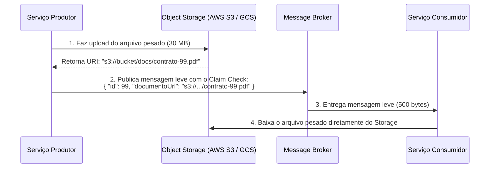

# Módulo 05: Padrões de Mensageria e Arquitetura

> [!NOTE]
> Este módulo aborda os padrões de integração e arquitetura mais consagrados da engenharia de software distribuída: desde os clássicos *Enterprise Integration Patterns* (EIP) até soluções para transações distribuídas (Saga) e escrita atômica (*Transactional Outbox*).

---

## 1. Padrões Fundamentais de Integração (EIP)

### 1.1. Ponto a Ponto (*Point-to-Point Channel*)
No padrão ponto a ponto, uma mensagem enviada para uma fila é processada por **exatamente um** consumidor.


- **Caso de uso típico:** Processamento de tarefas de segundo plano (background jobs), filas de conversão de mídia, envio de relatórios.

---

### 1.2. Publicador/Assinante (*Publish-Subscribe / Pub-Sub*)
No modelo Pub/Sub, o produtor envia a mensagem para um canal (tópico), e o intermediário entrega uma cópia para **todos** os consumidores inscritos naquele canal.


- **Caso de uso típico:** Divulgação de eventos de domínio em arquiteturas orientadas a eventos (EDA).

---

### 1.3. Consumidores Concorrentes (*Competing Consumers*)
Quando a velocidade de entrada de mensagens na fila é maior do que um único consumidor consegue processar, você instancia **múltiplas réplicas do mesmo consumidor** conectadas à mesma fila.


- **Mecanismo:** O broker distribui as mensagens entre os trabalhadores concorrentes (tipicamente em round-robin ou conforme a capacidade de cada um através de pré-busca/*prefetch*).
- **Vantagem:** Escalabilidade horizontal linear do processamento sem duplicar o trabalho de negócio.

---

### 1.4. Request-Reply Assíncrono (*Correlation ID e Reply-To*)
Às vezes, um cliente precisa enviar uma solicitação via mensageria e receber uma resposta específica de volta de forma desacoplada. Como fazer isso sem conexões HTTP síncronas?



1. O cliente gera um identificador único de correlação (`Correlation ID: abc-99`).
2. O cliente envia a mensagem indicando nos metadados onde quer a resposta (`Reply-To: fila-respostas`).
3. O trabalhador executa o processamento e devolve a resposta na fila informada mantendo o mesmo `Correlation ID`.
4. O cliente recupera a mensagem da fila de resposta e sabe exatamente a qual solicitação ela pertence.

---

## 2. Padrões Avançados para Sistemas Distribuídos

### 2.1. O Dilema da Escrita Dupla (*Dual Write Problem*) e o Transactional Outbox Pattern

Considere o seguinte código muito comum em microsserviços:

```
funcao finalizarCompra(pedido) {
    1. bancoDeDados.salvar(pedido);     // Transação no PostgreSQL
    2. messageBroker.publicar(pedido);   // Publicação no RabbitMQ/Kafka
}
```

> [!CAUTION]
> **O Perigo do Dual Write:**
> - Se o passo 1 rodar com sucesso, mas o broker de mensageria estiver momentaneamente inacessível ou o servidor reiniciar antes do passo 2, o pedido existirá no banco, mas **nenhum evento será emitido**. O estoque nunca será reservado!
> - Se você inverter a ordem (publicar primeiro e salvar depois), o broker pode aceitar a mensagem, mas a transação do banco falhar por violação de chave primária. O sistema emitirá um evento de algo que não existe no banco!

#### A Solução: Transactional Outbox Pattern



- A mensagem a ser publicada é gravada em uma tabela chamada `outbox` **dentro da exata mesma transação ACID do banco de dados relacional** onde o pedido é salvo.
- Se a transação falhar, nada é gravado. Se passar, o pedido e a mensagem são gravados de forma 100% atômica.
- Um processo independente em segundo plano (via Change Data Capture - CDC como Debezium, ou um leitor periódico) lê os registros da tabela `outbox` e publica no Message Broker com segurança.

---

### 2.2. Padrão Saga (*Saga Pattern*)

Quando uma operação de negócio precisa alterar dados em múltiplos microsserviços com bancos separados (onde não existe transação ACID tradicional), usamos o **Padrão Saga**: uma sequência de transações locais onde cada serviço atualiza seus dados e dispara o próximo passo via eventos.

Se algum passo falhar, a Saga executa **Transações Compensatórias** para desfazer os passos anteriores.



Existem duas formas de implementar uma Saga:

#### A. Coreografia (*Choreography*)
- **Sem coordenador central:** Os serviços conversam entre si reagindo aos eventos uns dos outros.
- *Fluxo:* Pedido emite `PedidoCriado` $\rightarrow$ Pagamento escuta e emite `PagamentoAprovado` $\rightarrow$ Estoque escuta e emite `EstoqueReservado`.
- **Vantagem:** Muito desacoplado, simples para fluxos pequenos (2 a 3 passos).
- **Desvantagem:** Em fluxos com muitos serviços, é difícil entender o quadro geral (risco de dependências circulares e "espaguete de eventos").

#### B. Orquestração (*Orchestration*)
- **Com coordenador central (Saga Orchestrator):** Um serviço mestre gerencia todo o estado da saga e envia **comandos** específicos para cada participante, aguardando suas respostas.
- **Vantagem:** Visibilidade centralizada e fácil tratamento de erros e compensações.
- **Desvantagem:** O orquestrador precisa conhecer a lógica do fluxo, aumentando a centralização.

---

### 2.3. Padrão Claim Check (*Comprovante de Bagagem*)

Message Brokers são otimizados para transportar **mensagens pequenas** e velozes (tipicamente de poucos kilobytes). Quando você tenta passar arquivos pesados (ex.: PDF de contrato de 30MB ou um vídeo de 1GB) por dentro de uma fila:
- A memória do broker sofre enorme pressão.
- A latência de rede entre nós do cluster dispara.
- O throughput geral da fila despenca.



- O produtor armazena a carga volumosa em um serviço de armazenamento de objetos (*Storage*).
- Apenas a referência / link (*Claim Check*) viaja na mensagem pelo broker.
- O consumidor lê o identificador e busca o conteúdo no storage conforme sua necessidade.

---

## 🎯 Perguntas para Autoavaliação e Fixação

1. *O que é o "Dual Write Problem" em microsserviços e de que maneira o Transactional Outbox Pattern elimina o risco de inconsistência?*
2. *Explique como funciona o padrão Competing Consumers e por que ele é crucial para escalabilidade horizontal.*
3. *Em uma Saga, qual é a diferença entre uma transação normal e uma "transação compensatória"?*
4. *Qual é o propósito do padrão Claim Check e quando ele deve ser obrigatoriamente utilizado?*

---

⬅️ [Módulo 04: Anatomia e Componentes](../04-anatomia-e-componentes/README.md) | ➡️ [Módulo 06: Garantias de Entrega e Consistência](../06-garantias-de-entrega-e-consistencia/README.md)
