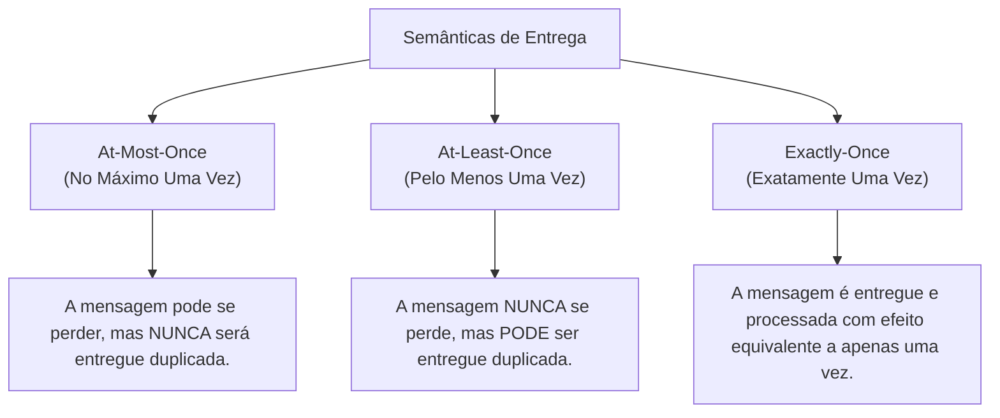
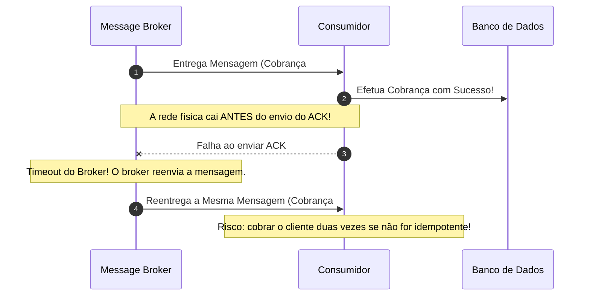
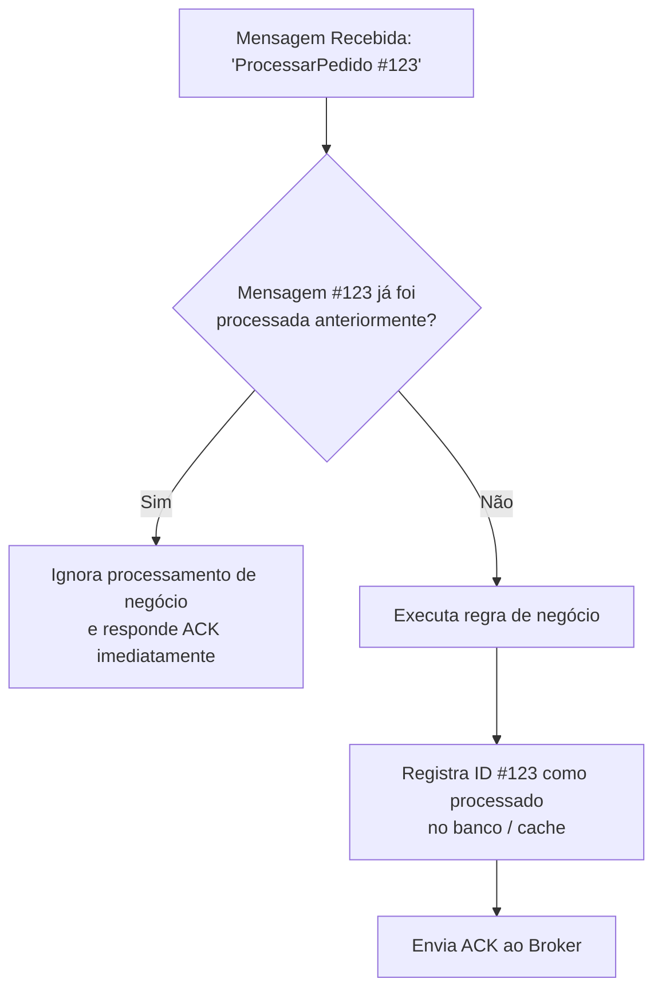
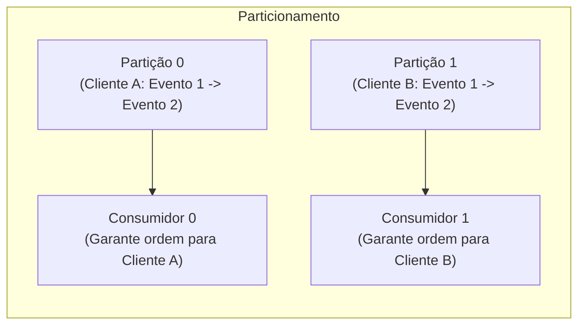

# Módulo 06: Garantias de Entrega, Idempotência e Consistência

> [!IMPORTANT]
> Em sistemas distribuídos, falhas de rede e reinicializações de servidores não são exceções: são certezas estatísticas. Este módulo explica como os sistemas de mensageria lidam com a confiabilidade das mensagens, o mito do "exatamente uma vez" e por que a **Idempotência** é uma obrigação do desenvolvedor.

---

## 1. As Três Semânticas de Entrega

Todo sistema de mensageria precisa escolher como negociar a relação entre velocidade, risco de perda de dados e risco de duplicação:



### 1.1. At-Most-Once (No Máximo Uma Vez - *Fire and Forget*)
- O broker envia a mensagem e **marca-a imediatamente como entregue**, sem esperar confirmação do consumidor.
- **Cenário de falha:** Se o consumidor sofrer um crash enquanto processa a mensagem, aquela mensagem está perdida para sempre.
- **Quando usar:** Métricas de telemetria de sensores de temperatura (se uma medição de 2 segundos atrás for perdida, a próxima suprirá a necessidade), contadores de cliques analíticos de baixa criticidade.

### 1.2. At-Least-Once (Pelo Menos Uma Vez - O Padrão da Indústria)
- O consumidor recebe a mensagem, executa o trabalho e **somente após a conclusão bem-sucedida** envia um sinal de confirmação (**ACK** - *Acknowledgment*) para o broker.
- Se o broker não receber o ACK dentro de um tempo limite (*timeout*) ou a conexão cair, ele assume que o consumidor falhou e **reenvia a mensagem**.
- **Cenário de duplicação:**



> [!WARNING]
> Como a maioria esmagadora das ferramentas opera em modo **At-Least-Once**, você DEVE assumir como premissa de arquitetura que **mensagens duplicadas chegarão ao seu consumidor**.

### 1.3. Exactly-Once (Exatamente Uma Vez - Mito vs Realidade)
Garantir que uma mensagem viaje por uma rede instável e produza efeitos colaterais de ponta a ponta sem nunca ter chance de ser reenviada é matematicamente impossível em termos puros de protocolo de rede (devido ao clássico *Problema dos Dois Generais*).

O que ferramentas como Apache Kafka denominam de "Exactly-Once Semantics" (EOS) na prática é:
$$\text{Exactly-Once} = \text{At-Least-Once Delivery} + \text{Deduplicação / Idempotência Transacional}$$

O broker garante que retransmissões internas entre produtor e broker sejam deduplicadas e comitadas atomicamente. Mas para o **efeito final no seu banco de dados**, a responsabilidade recai sobre o design do seu consumidor!

---

## 2. O Imperativo da Idempotência

### O Que é uma Operação Idempotente?
Na matemática e na ciência da computação, uma operação é dita **idempotente** se a aplicação repetida da operação produz o mesmo resultado final que uma única aplicação:
$$f(f(x)) = f(x)$$

No contexto de mensageria: **Se o seu consumidor receber a mensagem `TransacaoAprovada(id: 99)` 5 vezes seguidas, o estado final do sistema deve ser exatamente o mesmo como se ele a tivesse recebido uma única vez.**



### Estratégias Práticas para Alcançar Idempotência

#### 1. Deduplication Store (Tabela de Mensagens Processadas / Chave Única)
- Ao receber a mensagem com `message_id = "abc-123"`, antes de processar, o consumidor tenta inserir esse ID em uma tabela de controle com restrição de chave única (`UNIQUE constraint`):
```sql
INSERT INTO mensagens_processadas (message_id, data_processamento)
VALUES ('abc-123', NOW());
```
- Se a inserção falhar por violação de unicidade, significa que a mensagem já foi tratada. O consumidor descarta o trabalho e apenas confirma o ACK ao broker.

#### 2. Operações de Negócio Naturalmente Idempotentes
Nem sempre é preciso armazenar IDs de mensagens se a própria operação for idempotente por natureza:
- **Não-idempotente:** `UPDATE conta SET saldo = saldo + 100;` (se rodar 2 vezes, soma 200).
- **Idempotente:** `UPDATE conta SET status = 'ATIVO';` (pode rodar 100 vezes, o status permanece 'ATIVO').
- **Idempotente via UPSERT:** `INSERT INTO cliente (id, nome) VALUES (1, 'Ana') ON CONFLICT (id) DO UPDATE SET nome = 'Ana';`.

#### 3. Máquina de Estados Finita (State Transitions)
Garantir que transições só ocorram a partir de estados válidos:
- Só transicionar de `CRIADO` para `PAGO`. Se a mensagem duplicada chegar e o pedido já estiver `PAGO`, a transição é ignorada com segurança.

---

## 3. Ordenação de Mensagens: O Dilema da Ordem Global

Uma pergunta frequente de quem inicia em mensageria é: *"Como garantir que todas as mensagens do meu sistema inteiro sejam processadas rigorosamente na ordem em que foram criadas?"*

> [!CAUTION]
> **Ordem Global Absoluta destrói a escalabilidade:**
> Para garantir ordem global estrita em todo o sistema, você precisaria de uma única fila física, um único processo consumidor e nenhuma concorrência. Qualquer paralelismo ou múltiplos nós quebram a ordem temporal estrita.

### A Solução: Ordenação Parcial por Entidade (*Partition Key*)
Na prática do mundo real, a ordem só importa **para a mesma entidade de negócio**!
- Não importa se o pedido do Cliente A foi processado antes ou depois do pedido do Cliente B.
- O que importa é que o evento `PedidoCriado` do Cliente A seja processado **antes** do evento `PedidoCancelado` do mesmo Cliente A!



Definindo o identificador da entidade (ex.: `cliente_id` ou `pedido_id`) como **chave de partição / routing key**, todas as mensagens daquela entidade trafegam pelo mesmo canal sequencial, mantendo a ordem sem sacrificar o paralelismo dos demais clientes.

---

## 4. Confirmações e Controle de Fluxo (*Backpressure*)

### Os Tipos de Acknowledgment
- **ACK (Positive Acknowledgment):** O consumidor informa ao broker que a mensagem foi processada com êxito. O broker pode descartá-la com segurança (em filas tradicionais) ou avançar o marcador de leitura (em logs de streaming).
- **NACK / Reject (Negative Acknowledgment):** O consumidor informa que não conseguiu processar a mensagem.
  - *Com Requeue:* A mensagem é reinserida na fila para ser tentada novamente.
  - *Sem Requeue:* A mensagem é descartada ou redirecionada para a **Dead Letter Queue (DLQ)**.

### Backpressure (Contrapressão) e Prefetch Count
O que acontece se uma fila contém 50.000 mensagens e um novo consumidor é inicializado?
- Se o broker tentar empurrar (*push*) todas as 50.000 mensagens para o consumidor de uma vez, a memória RAM do processo consumidor esgotará (Out of Memory - OOM).
- **Prefetch Count:** Configuração onde o consumidor define quantas mensagens ele aceita receber simultaneamente sem ter enviado o ACK (ex.: `prefetch = 10`). O broker só envia a 11ª mensagem depois que o consumidor confirmar o ACK de alguma das anteriores.

---

## 🎯 Perguntas para Autoavaliação e Fixação

1. *Por que a estratégia At-Least-Once quase inevitavelmente resulta na entrega de mensagens duplicadas em cenários de falhas de rede?*
2. *Explique o que é Idempotência e dê um exemplo prático de como transformar uma operação de atualização de saldo em uma operação idempotente.*
3. *Por que tentar forçar uma ordem global em todas as mensagens do sistema prejudica a escalabilidade horizontal? Como o particionamento resolve isso?*
4. *O que é "Prefetch Count" e como ele protege a memória e estabilidade dos workers consumidores?*

---

⬅️ [Módulo 05: Padrões de Mensageria](../05-padroes-de-mensageria/README.md) | ➡️ [Módulo 07: Ecossistema e Comparativo](../07-ecossistema-e-comparativo/README.md)
