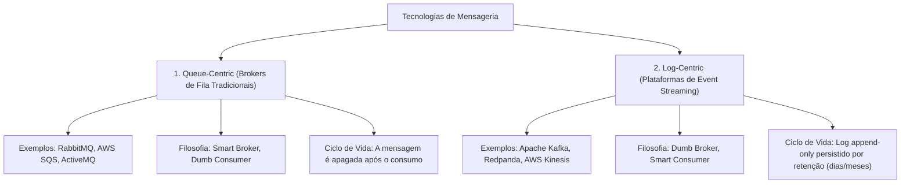
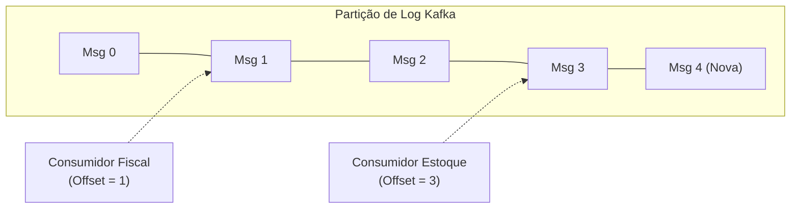
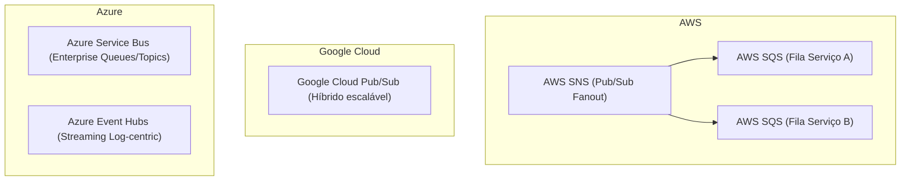
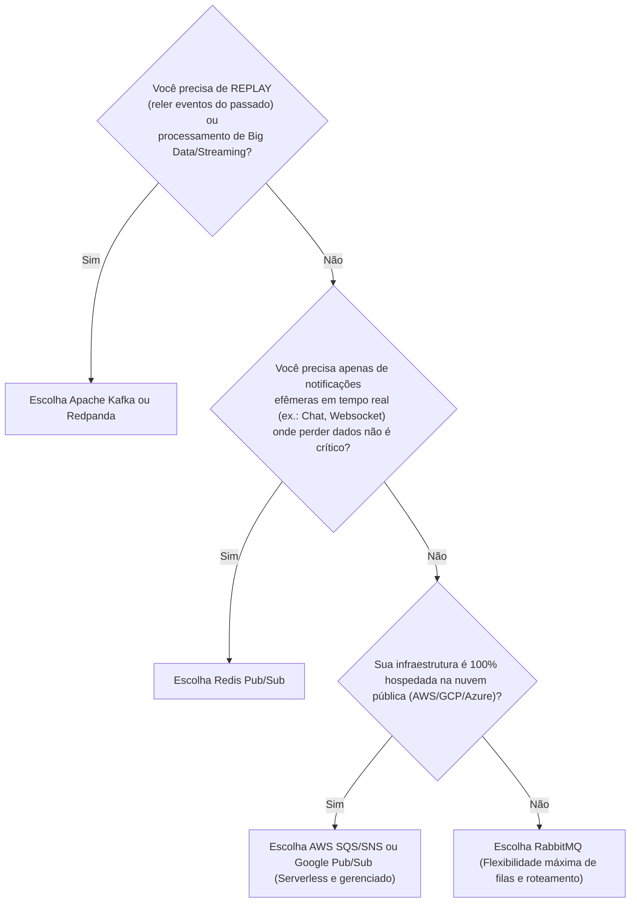

# Módulo 07: Ecossistema, Abordagens e Matriz Comparativa

> [!NOTE]
> Este módulo consolida a visão teórica comparando as duas filosofias dominantes da indústria: **Brokers Tradicionais Centrados em Filas** (*Queue-centric*) versus **Plataformas de Streaming Centradas em Logs** (*Log-centric*), além de oferecer um guia de decisão prático.

---

## 1. As Duas Grandes Filosofias de Mensageria

No ecossistema atual, quase todas as tecnologias de mensageria pertencem a uma destas duas grandes famílias conceituais:



---

### Filosofia A: Queue-Centric (Smart Broker, Dumb Consumer)

Nesta abordagem clássica (exemplificada por **RabbitMQ** e **AWS SQS**):
- **O Broker é Inteligente:** Ele rastreia individualmente o estado de cada mensagem (se foi entregue, se está em voo, se recebeu ACK ou NACK).
- **Consumo Destrutivo:** Uma vez que o consumidor processa a mensagem e envia o ACK, **a mensagem é removida fisicamente da fila**.
- **Roteamento Complexo:** Oferece grande flexibilidade de regras de roteamento (exchanges diretas, por tópicos, por headers).
- **Consumidor Simples:** O consumidor apenas pede uma mensagem, processa e diz *"concluí"*.

```mermaid
flowchart LR
    P["Produtor"] --> B[("RabbitMQ / SQS\n(Gerencia status de cada mensagem)")]
    B -->|"Entrega msg 1"| C["Consumidor"]
    C -->|"ACK"| B
    Note over B: Msg 1 é DELETADA da fila!
```

---

### Filosofia B: Log-Centric (Dumb Broker, Smart Consumer)

Nesta abordagem moderna de streaming de eventos (exemplificada por **Apache Kafka** e **Redpanda**):
- **O Broker é um Log Append-Only:** Mensagens entram sequencialmente no final de um arquivo de log imutável gravado em disco.
- **Consumo Não-Destrutivo:** O consumo **não apaga** a mensagem! As mensagens permanecem armazenadas de acordo com uma política de retenção (ex.: 7 dias, 30 dias ou para sempre).
- **Controle por Offset:** Cada consumidor controla apenas um ponteiro numérico chamado **Offset** (indicando qual foi a última mensagem lida por ele naquele log).
- **Time-Travel / Replay:** Se um bug for descoberto no código do consumidor, você pode simplesmente **retroceder o offset para o início da semana** e reprocessar todos os eventos históricos novamente!



---

## 2. Matriz Comparativa Detalhada

| Critério | Filas Tradicionais (ex.: RabbitMQ, AWS SQS) | Event Streaming (ex.: Apache Kafka, Kinesis) | Cache Pub/Sub (ex.: Redis Pub/Sub) |
| :--- | :--- | :--- | :--- |
| **Modelo Conceitual** | Fila transitória de mensagens | Log distribuído de eventos particionado | Canal de transmissão em memória |
| **Persistência / Retenção** | Efêmera (apagada após ACK) | Durável por tempo ou tamanho (dias/anos) | Volátil (se não houver ninguém ouvindo, a mensagem é descartada) |
| **Capacidade de Replay** | **Não.** Mensagem consumida desaparece | **Sim.** Qualquer consumidor pode reler o histórico | **Não.** Totalmente efêmero |
| **Taxa de Transferência** | Milhares a dezenas de milhares de msgs/seg | Centenas de milhares a milhões de msgs/seg | Muito alta (limitada pela RAM e single-thread do Redis) |
| **Capacidade de Roteamento** | Altíssima e dinâmica (Exchanges, Topics, Headers) | Simples (por tópico e chave de partição) | Simples (padrões de canais por string) |
| **Complexidade Operacional** | Média | Alta (exige Zookeeper/KRaft, planejamento de partições) | Muito baixa |
| **Casos Ideais de Uso** | Background jobs, tarefas assíncronas pontuais, sistemas transacionais | Telemetria, auditoria imutável, CDC (Change Data Capture), Event Sourcing, Big Data | Notificações de chat web em tempo real, invalidação de caches |

---

## 3. Serviços em Nuvem Gerenciados (Cloud-Native)

Se você utiliza nuvens públicas (AWS, GCP, Azure), existem pares de tecnologias gerenciadas que implementam esses conceitos sem a necessidade de provisionar máquinas virtuais:



- **Padrão AWS SNS + SQS (Fanout Pattern):** O produtor publica uma vez no **SNS** (tópico pub/sub). O SNS copia e distribui a mensagem para múltiplas filas **SQS**, permitindo que diferentes serviços processem o evento com retries e DLQs individuais.

---

## 4. Árvore de Decisão: Qual Escolher?

Use o fluxograma abaixo como guia para orientar suas decisões de projeto:



---

## 🎯 Perguntas para Autoavaliação e Fixação

1. *O que significa a distinção "Smart Broker, Dumb Consumer" versus "Dumb Broker, Smart Consumer"?*
2. *Explique como o conceito de "Offset" no Apache Kafka permite que um novo consumidor leia dados do início do mês sem afetar os outros consumidores.*
3. *Em que tipo de cenário o RabbitMQ é superior ao Kafka? Dê um exemplo concreto.*
4. *Por que o Redis Pub/Sub puro não deve ser usado para processamento financeiro crítico de pagamentos?*

---

⬅️ [Módulo 06: Garantias de Entrega e Consistência](../06-garantias-de-entrega-e-consistencia/README.md) | 🏠 [Voltar ao Índice Principal](../README.md)
