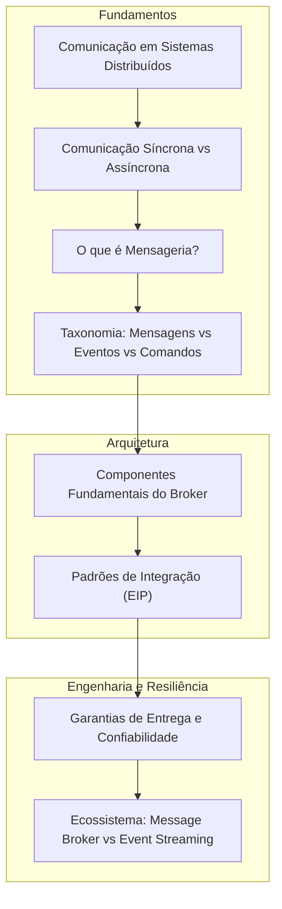

# Guia Teórico e Conceitual de Mensageria e Eventos

Bem-vindo ao repositório de estudos conceituais sobre **Mensageria**, **Comunicação Assíncrona** e **Arquiteturas Orientadas a Eventos (EDA)**.

Este material foi construído para servir como base teórica sólida, independente de linguagem de programação ou ferramenta específica, permitindo que você compreenda as motivações de engenharia de software, os padrões fundamentais de integração e os desafios inerentes aos sistemas distribuídos.

---

## 🗺️ Mapa Mental da Trilha de Estudos

---

## 🎤 Kit de Preparação: Palestra no AWS Community Day

> **Palestra:** *"Primeiros Passos em Mensageria: SQS, SNS, Kafka e o Mundo dos Eventos"*  
> **Formato:** Apresentação em trio (3 palestrantes) | 40 a 45 minutos  
> **Acesso Rápido ao Kit da Palestra:** [Acessar Pasta da Palestra](./palestra-aws-community-day/README.md)

| Material | Finalidade |
| :--- | :--- |
| [**01. Roteiro Slide a Slide**](./palestra-aws-community-day/01-roteiro-e-slides.md) | Estrutura de 20 slides, divisão de fala entre os 3 palestrantes, ganchos de transição e armadilhas de palco. |
| [**02. O Estudo de Caso Guia**](./palestra-aws-community-day/02-estudo-de-caso-loja-nuvem.md) | Storytelling unificado da "TechStore Nuvem": da dor síncrona até SQS, SNS, Kafka/MSK e EDA. |
| [**03. Guia Prático SQS, SNS e MSK**](./palestra-aws-community-day/03-guia-aws-sqs-sns-msk.md) | Aprofundamento técnico nos serviços AWS do título, parâmetros críticos e tabela comparativa. |
| [**04. Analogias e FAQ da Plateia**](./palestra-aws-community-day/04-analogias-e-faq-plateia.md) | 5 metáforas memoráveis para o palco e respostas prontas para perguntas difíceis no Q&A. |

---

## 📚 Trilha Teórica de Aprendizagem

A documentação conceitual de base está dividida em 7 módulos sequenciais:

| Módulo | Tema Principal | Descrição |
| :--- | :--- | :--- |
| [**01. Fundamentos da Comunicação**](./01-fundamentos-da-comunicacao/README.md) | Síncrono vs Assíncrono | Dimensões de acoplamento (temporal, espacial, protocolo), chamadas bloqueantes vs não-bloqueantes e falhas em cascata. |
| [**02. O Que é Mensageria**](./02-o-que-e-mensageria/README.md) | Conceito e Motivações | Definição formal de Message-Oriented Middleware (MOM), benefícios (resiliência, escalabilidade, nivelamento de carga) e trade-offs. |
| [**03. Mensagens, Eventos e Comandos**](./03-mensagens-eventos-e-comandos/README.md) | Semântica da Informação | Diferenciação conceitual crucial: Comandos (imperativos), Eventos (fatos imutáveis) e Mensagens (envelope), além de padrões de eventos. |
| [**04. Anatomia e Componentes**](./04-anatomia-e-componentes/README.md) | Estrutura Interna | Produtores, Consumidores, Brokers, Filas, Tópicos, Partições, Exchanges, Headers, Payload e Dead Letter Queues (DLQ). |
| [**05. Padrões de Mensageria**](./05-padroes-de-mensageria/README.md) | Padrões de Integração (EIP) | Point-to-Point, Publish-Subscribe, Competing Consumers, Request-Reply Assíncrono, Saga Pattern e Transactional Outbox. |
| [**06. Garantias de Entrega e Consistência**](./06-garantias-de-entrega-e-consistencia/README.md) | Confiabilidade e Resiliência | Semânticas de entrega (At-most-once, At-least-once, Exactly-once), o imperativo da Idempotência, ordenação e backpressure. |
| [**07. Ecossistema e Comparativo**](./07-ecossistema-e-comparativo/README.md) | Abordagens e Tecnologias | Filas Tradicionais (RabbitMQ, SQS) vs Plataformas de Event Streaming (Kafka), matriz comparativa e árvore de decisão. |

---

## 📖 Glossário Rápido de Conceitos Essenciais

- **Producer (Produtor / Publisher):** Componente responsável por criar e enviar mensagens para um canal ou intermediário.
- **Consumer (Consumidor / Subscriber / Worker):** Componente responsável por receber, processar e responder a mensagens enviadas a um canal.
- **Message Broker:** O middleware/servidor intermediário responsável por receber, armazenar, rotear e entregar mensagens entre produtores e consumidores.
- **Queue (Fila):** Estrutura de dados que armazena mensagens temporariamente, tipicamente operando com semântica ponto-a-ponto (Point-to-Point) onde uma mensagem é consumida por apenas um destinatário.
- **Topic (Tópico):** Canal de distribuição de mensagens baseado no modelo Publicador/Assinante (Pub/Sub), onde múltiplos consumidores interessados recebem uma cópia de cada mensagem.
- **Payload:** O corpo de dados útil da mensagem (a carga de negócio, geralmente formatada em JSON, Avro, Protobuf, etc.).
- **Headers / Metadados:** Informações de controle anexadas à mensagem (IDs de correlação, carimbos de tempo, tipo de conteúdo, origem, chaves de rastreamento distribuído).
- **Idempotência:** Propriedade de uma operação que produz o mesmo resultado no sistema quer ela seja executada uma vez ou múltiplas vezes com a mesma entrada.
- **Dead Letter Queue (DLQ):** Fila de descarte para mensagens que falharam repetidamente no processamento e não puderam ser tratadas, isolando-as para análise manual ou correção.
- **Backpressure (Contrapressão):** Mecanismo de controle de fluxo pelo qual um consumidor sobrecarregado sinaliza ou limita a taxa de envio de novas mensagens por parte do intermediário.

---

## 🎯 Como Aproveitar Este Estudo

1. **Siga a ordem dos módulos:** Os conceitos são construídos de forma incremental, partindo de noções de redes e sistemas distribuídos até padrões arquiteturais complexos.
2. **Observe os diagramas de sequência e fluxo:** Mensageria é uma disciplina visual; entender a linha do tempo das chamadas é o segredo para não cometer erros de design.
3. **Foque nos conceitos antes das ferramentas:** Frameworks e ferramentas mudam ou têm sintaxes distintas, mas os conceitos (idempotência, garantias de entrega, acoplamento temporal) são universais em qualquer tecnologia.
