# Roteiro da Palestra: Slide a Slide e Transições

> **Título:** Primeiros Passos em Mensageria: SQS, SNS, Kafka e o Mundo dos Eventos  
> **Evento:** AWS Community Day  
> **Tempo Total:** 40 a 45 minutos (divididos entre os 3 palestrantes) + 5 min Q&A

---

## 🧭 Visão Geral da Linha do Tempo

```mermaid
gantt
    title Cronograma de Apresentação (42 minutos)
    dateFormat  m
    axisFormat %M min

    section Palestrante 1 (Abertura, Dor Síncrona e Fundamentos)
    Abertura e Caso TechStore           :0, 4m
    O Desastre Síncrono e Acoplamento   :4, 8m
    O que é Mensageria e Componentes   :8, 12m

    section Palestrante 2 (Modo Fila e Modo Pub/Sub na AWS)
    Amazon SQS (Modo Fila)             :12, 19m
    Amazon SNS (Modo Pub/Sub)          :19, 24m
    Padrão SNS + SQS Fanout            :24, 27m

    section Palestrante 3 (Log de Eventos, EDA e Conclusão)
    Limites das Filas e Modo Log       :27, 31m
    Apache Kafka e Amazon MSK          :31, 36m
    Mensageria como Espinha Dorsal (EDA):36, 40m
    Recapitulando e Q&A                :40, 42m
```

---

## 🎬 Bloco 1: A Dor Síncrona e o Despertar da Mensageria (~12 min)
**Responsável:** Palestrante 1

### Slide 01: Capa da Palestra
- **Visual:** Título marcante, logos oficiais de comunidade, fotos/redes dos 3 palestrantes.
- **Talking Points:**
  - Boas-vindas calorosas à comunidade do AWS Community Day.
  - Apresentação rápida do trio (10 segundos cada um: nome, papel atual e foco).
  - Promessa da palestra: *"Hoje vamos sair do clássico 'o servidor caiu com timeout' e entender a espinha dorsal dos sistemas modernos e resilientes na nuvem."*

### Slide 02: O Cenário: A Inauguração da "TechStore Nuvem"
- **Visual:** Ilustração de um e-commerce em dia comum vs na Black Friday (carrinhos cheios, contagem regressiva).
- **Talking Points:**
  - Apresentar a nossa empresa fictícia: *TechStore Nuvem*.
  - Arquitetura inicial: Uma API que recebe o pedido, processa pagamento, reserva estoque, gera nota fiscal e envia e-mail de confirmação.
  - Tudo parecia lindo em ambiente de desenvolvimento com 5 usuários de teste...

### Slide 03: O Desastre da Comunicação Síncrona (A Falha em Cascata)
- **Visual:** Diagrama de sequência animado: `Checkout -> Pagamento -> Estoque -> NF -> E-mail` onde o serviço de e-mail fica lento (3s) e trava toda a requisição HTTP. Erro 504 Gateway Timeout na tela do cliente.
- **Talking Points:**
  - Explicar o que é comunicação síncrona: o cliente fica preso aguardando cada milissegundo de cada dependência.
  - O perigo do **Acoplamento Temporal**: se o serviço de e-mail oscilar ou o banco de estoque travar por 5 segundos, o usuário não consegue nem finalizar a compra.
  - O pool de threads do servidor esgota; o servidor inteiro para de responder.
  - Frase de impacto: *"Por que o cliente tem que ficar olhando uma rodinha girando no navegador enquanto esperamos um e-mail ser disparado?"*

### Slide 04: A Mudança de Paradigma: O Que é Mensageria?
- **Visual:** Comparação visual entre uma ligação telefônica (síncrona) e uma caixa postal / correspondência (assíncrona).
- **Talking Points:**
  - Mensageria é comunicação mediada por um intermediário confiável (*Message Broker*).
  - Em vez de fazer tudo na mesma transação HTTP, o serviço apenas diz: *"Pedido recebido com sucesso!"*, deposita a mensagem no broker e libera o cliente imediatamente.
  - O processamento pesado ocorre em segundo plano.

### Slide 05: Os 3 Superpoderes da Mensageria
- **Visual:** Três ícones: Desacoplamento (elastecer laços), Resiliência (escudo) e Nivelamento de Picos (amortecedor).
- **Talking Points:**
  - **Desacoplamento:** O serviço de vendas não precisa saber como o estoque funciona nem qual o IP dele.
  - **Resiliência:** Se o serviço de nota fiscal cair por 10 minutos para deploy, nenhum pedido se perde. Ficam guardados no broker.
  - **Nivelamento de Picos (*Load Leveling*):** Se chegarem 10.000 requisições por segundo na Black Friday, o broker absorve o impacto e os trabalhadores consomem no ritmo saudável que o banco de dados suporta.

### Slide 06: A Anatomia Essencial da Mensageria
- **Visual:** Diagrama simples com os 3 atores: Produtor $\rightarrow$ Broker (com Fila/Canal) $\rightarrow$ Consumidor. Destaque para o envelope da mensagem (Headers + Payload).
- **Talking Points:**
  - **Produtor (*Producer*):** Quem gera a mensagem (nossa API de Checkout).
  - **Message Broker:** O serviço que recebe, guarda e encaminha (o correio).
  - **Consumidor (*Consumer / Worker*):** Quem faz o trabalho sujo em background.
  - A mensagem: Metadados no cabeçalho (ID, timestamp, correlation ID) e o Payload em JSON.

### Slide 07: Gancho de Passagem de Bastão (Transição para o Palestrante 2)
- **Fala de Transição:**
  > *"Beleza, entendemos a dor e o conceito! Mas como colocar isso na prática dentro da AWS? Se formos abrir o console da AWS agora, qual serviço usamos? Uma fila simples? Um tópico? Para mostrar como a TechStore Nuvem resolveu isso usando SQS e SNS, passo a palavra para o [Nome do Palestrante 2]!"*

---

## ⚡ Bloco 2: O Modo Fila e o Modo Pub/Sub na AWS (~15 min)
**Responsável:** Palestrante 2

### Slide 08: Entrando no Ecossistema AWS: O Modo Fila com Amazon SQS
- **Visual:** Logo do Amazon SQS, diagrama de fila FIFO conceitual (Primeiro a Entrar, Primeiro a Sair) com múltiplos workers processando.
- **Talking Points:**
  - O que é o **Amazon SQS (Simple Queue Service)**: um dos serviços mais antigos, estáveis e escaláveis de toda a AWS.
  - Totalmente *serverless* e gerenciado: você não provisiona servidor, não configura cluster, paga apenas pelo que usa.
  - Padrão **Ponto a Ponto (*Point-to-Point*)**: uma mensagem é colocada na fila e consumida por **apenas um** trabalhador.

### Slide 09: Segredos de Funcionamento do SQS (O Que Você Precisa Saber)
- **Visual:** Diagrama mostrando o ciclo de vida: `Mensagem na Fila -> Worker consome -> Visibility Timeout -> DeleteMessage (ACK)`.
- **Talking Points:**
  - **Visibility Timeout:** Quando um worker lê a mensagem, ela não é apagada na hora! Ela fica invisível temporariamente (ex.: 30s) para que outros workers não peguem a mesma tarefa.
  - Se o worker terminar com sucesso, ele faz `DeleteMessage` (ACK). Se o worker morrer no meio, o tempo expira e a mensagem volta a ficar visível para outro worker tentar.
  - **Dead Letter Queue (DLQ):** Se uma mensagem falhar 5 vezes seguidas (*maxReceiveCount*), ela vai para a DLQ para não travar a fila com uma mensagem tóxica (*poison pill*).

### Slide 10: SQS Standard vs SQS FIFO: O Grande Dilema
- **Visual:** Tabela comparativa simplificada e direta.
- **Talking Points:**
  - **Standard (Padrão):** Vazão praticamente ilimitada, entrega *At-Least-Once* (pode ter duplicados ocasionais), melhor esforço de ordenação.
  - **FIFO (First-In-First-Out):** Ordem estrita garantida, sem duplicatas (*Exactly-Once processing* via Message Deduplication ID), throughput limitado (até 3.000 msgs/s com batching no modo de alto throughput).
  - Dica de ouro: *"Use Standard sempre que possível com consumidores idempotentes. Use FIFO apenas se a ordem estrita de negócio for inegociável."*

### Slide 11: O Novo Problema da TechStore: O SQS Sozinho Não Basta!
- **Visual:** A API tentando enviar o mesmo pedido para 3 filas SQS diferentes (Fila de Estoque, Fila Fiscal, Fila de Notificação). A API voltou a ficar acoplada!
- **Talking Points:**
  - A loja cresceu: agora, quando um pedido é pago, precisamos avisar o Estoque, o Fiscal E o Marketing.
  - Se o Checkout tiver que postar em 3 filas SQS separadas, voltamos a acoplar o produtor! Se amanhã criarmos o time de Fraude, teremos que alterar a API de Checkout de novo.
  - É aqui que entra o **Modo Publicador/Assinante (Pub/Sub)**!

### Slide 12: Amazon SNS: O Modo Pub/Sub
- **Visual:** Logo do Amazon SNS, diagrama de 1 Tópico disparando mensagens para múltiplos destinos.
- **Talking Points:**
  - O que é o **Amazon SNS (Simple Notification Service)**.
  - Modelo 1 para N (*Broadcast*): O produtor publica uma única vez em um **Tópico SNS**.
  - O SNS se encarrega de empurrar (*push*) aquela mensagem para todos os assinantes interessados.

### Slide 13: O Padrão Canônico da AWS: SNS + SQS (Fanout Pattern)
- **Visual:** Diagrama arquitetural consagrado: `Checkout -> SNS Topic (pedido-pago) -> 3 Filas SQS independentes (Estoque, Fiscal, Notificação) -> Workers`.
- **Talking Points:**
  - Este é o padrão mais famoso e utilizado em arquiteturas de microsserviços na AWS!
  - O Checkout só conhece o tópico do SNS (desacoplamento total).
  - Cada serviço consumidor tem sua própria fila SQS com suas próprias regras de retry, DLQ e velocidade de consumo.
  - Se o serviço Fiscal cair, a fila dele enche, mas o Estoque e a Notificação continuam rodando sem sofrer nenhum impacto!
  - Menção rápida: **SNS Subscription Filter Policies** (o consumidor pode filtrar para receber apenas pedidos acima de R$ 1.000 ou de determinada região).

### Slide 14: Gancho de Passagem de Bastão (Transição para o Palestrante 3)
- **Fala de Transição:**
  > *"Vimos como SQS e SNS resolvem filas e distribuição de eventos com maestria. Mas e se a TechStore crescer a ponto de ter milhões de eventos por segundo de cliques de navegação? E se o time de auditoria disser: 'preciso reprocessar tudo o que aconteceu nos últimos 15 dias'? Fila tradicional apaga a mensagem depois do ACK! Como resolvemos isso? Para falar do modo Log de Eventos com Kafka e Amazon MSK, passo a bola para o [Nome do Palestrante 3]!"*

---

## 🚀 Bloco 3: O Log de Eventos e a Visão de EDA (~13 min)
**Responsável:** Palestrante 3

### Slide 15: O Limite das Filas e a Necessidade de um Log
- **Visual:** Comparação gráfica: Fila tradicional (mensagem consumida é destruída) vs Livro-razão / Fita gravada (mensagens permanecem para sempre).
- **Talking Points:**
  - Filas tradicionais são efêmeras: seu objetivo é esvaziar a fila o mais rápido possível.
  - Mas e quando o evento **é a história da empresa**?
  - Casos de uso modernos: rastreamento de cliques (*clickstream*), telemetria em tempo real, detecção de fraudes analisando janelas de tempo, e a necessidade de **Replay** (reler o passado se um código tiver bug).
  - É aqui que mudamos de *Message Queues* para **Event Streaming**.

### Slide 16: O Que é Apache Kafka? O Modo Log de Eventos
- **Visual:** Diagrama de Partições do Kafka com mensagens numeradas sequencialmente `[0][1][2][3][4]` e ponteiros de **Offset** de diferentes consumidores.
- **Talking Points:**
  - O Kafka não é uma fila de mensagens; é um **log distribuído, imutável e append-only**.
  - As mensagens entram no final do log e **não são apagadas após o consumo**! Elas ficam gravadas por tempo (ex.: 7 dias, 30 dias ou indefinidamente).
  - O consumidor controla apenas um ponteiro chamado **Offset**.
  - Se você subir um serviço novo de Machine Learning hoje, ele pode colocar o offset no zero e treinar com todos os dados da história da loja!

### Slide 17: Kafka Gerenciado na AWS: O Que é o Amazon MSK?
- **Visual:** Logo do Amazon MSK (Managed Streaming for Apache Kafka) com ilustrações dos nós gerenciados pela AWS (sem dores de cabeça manuais de SO e patches).
- **Talking Points:**
  - Rodar Kafka por conta própria (*self-hosted* em instâncias EC2) é famoso pela complexidade operacional (configurar ZooKeeper/KRaft, rebalanceamento de partições, patches do SO).
  - O **Amazon MSK** é o Kafka totalmente gerenciado pela AWS: alta disponibilidade multi-AZ, criptografia nativa e integração com IAM.
  - Existe também o **Amazon MSK Serverless** para quem quer começar sem gerenciar capacidade de brokers.

### Slide 18: Tabela Definitiva: SQS vs SNS vs Kafka (MSK)
- **Visual:** Tabela limpa e comparativa com os 3 serviços em colunas.
- **Talking Points:**
  - **SQS:** Fila de trabalho ponto a ponto. Quando você precisa apenas processar jobs de forma desacoplada com zero manutenção.
  - **SNS:** Pub/Sub para notificação e fanout. Quando você quer disparar o mesmo evento para múltiplos destinos (filas, lambdas, e-mails).
  - **Kafka / MSK:** Log de streaming contínuo. Quando você precisa de altíssima escala (milhões/s), retenção durável, replay de eventos e ordem estrita por chave de partição.
  - Mensagem-chave: *"Não existe um serviço melhor que o outro; eles resolvem problemas fundamentalmente diferentes!"*

### Slide 19: A Grande Conexão: Arquitetura Orientada a Eventos (EDA)
- **Visual:** Ilustração arquitetural mostrando a Mensageria como a **Espinha Dorsal (*Backbone*)** que conecta microsserviços, lambdas e bancos de dados através de eventos de negócio (`PedidoCriado`, `PagamentoAprovado`).
- **Talking Points:**
  - O que é EDA em poucas palavras: um sistema que reage a mudanças de estado em tempo real.
  - A mensageria (seja via SQS/SNS ou Kafka) é a infraestrutura física que permite a EDA existir.
  - Benefício de negócio: Agilidade extrema! Quer lançar um novo recurso? Basta ouvir os eventos existentes na espinha dorsal, sem encostar em nenhuma linha de código dos sistemas antigos.

### Slide 20: Conclusão, Dicas de Ouro e Q&A
- **Visual:** 3 bullet points de resumo, QR Code para o repositório no GitHub com as notas completas de estudo, agradecimentos à AWS e à organização.
- **Talking Points:**
  - **Os 3 palestrantes voltam juntos à frente do palco:**
    1. *Palestrante 1:* Comece simples: identifique onde suas chamadas síncronas estão te machucando e use filas.
    2. *Palestrante 2:* Aproveite o poder do SNS + SQS para desacoplar seus serviços na AWS com facilidade serverless.
    3. *Palestrante 3:* Evolua para o modelo de streaming com Kafka/MSK quando sua necessidade de escala e histórico exigir.
  - Chamada final: *"Muito obrigado a todos! Estamos prontos para as perguntas da plateia!"*
