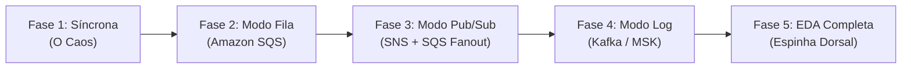
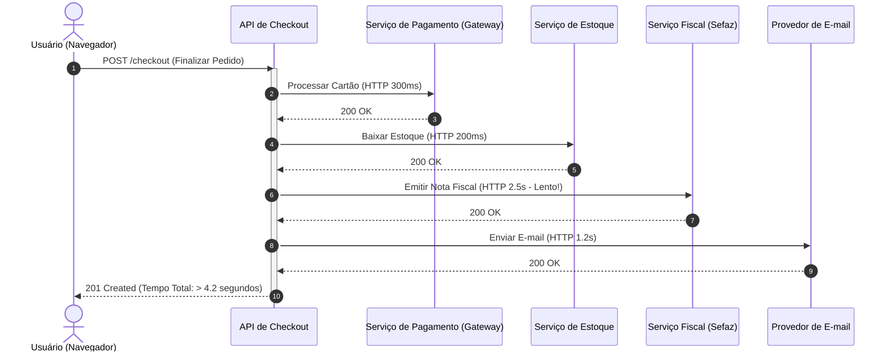
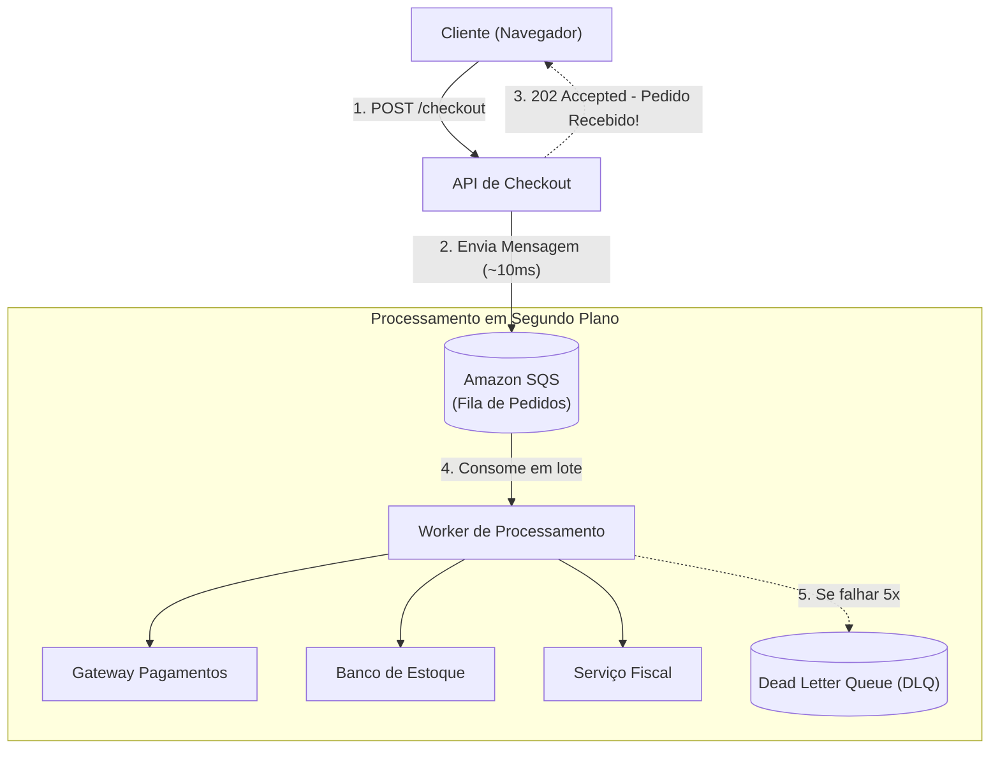
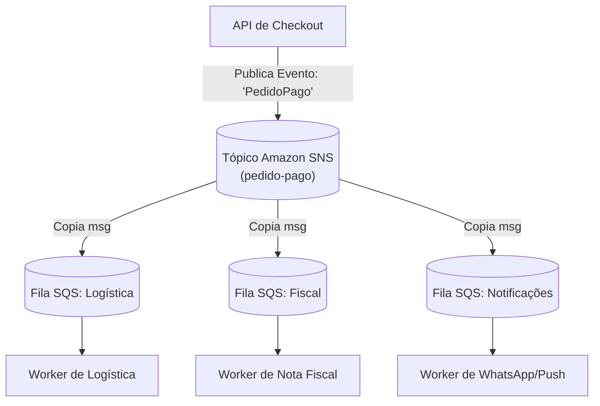
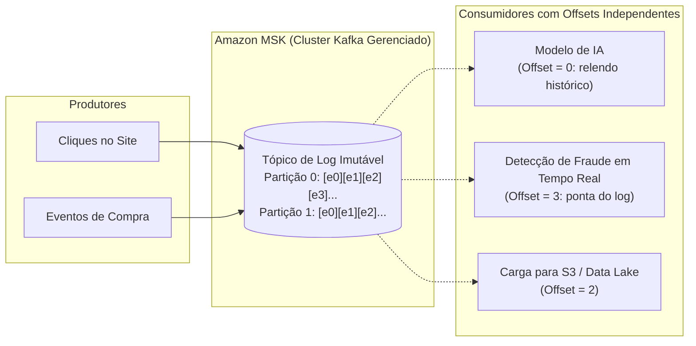
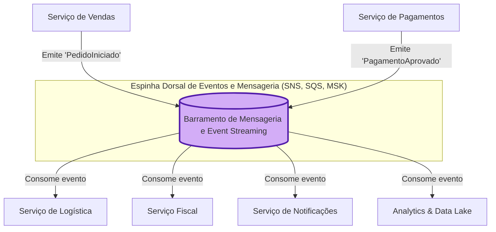

# O Estudo de Caso Guia: A Evolução da "TechStore Nuvem"

> [!TIP]
> Ter um **fio condutor único** que evolui ao longo da palestra é a melhor técnica de apresentação técnica. Isso evita que a plateia se perca em exemplos desconexos e faz com que cada tecnologia apareça como a solução natural para uma dor real do negócio.

---

## 🏬 A História da TechStore Nuvem

A **TechStore Nuvem** é uma empresa fictícia de comércio eletrônico. Acompanharemos sua jornada de arquitetura através de 5 fases evolutivas:

---

## 💥 Fase 1: A Arquitetura Síncrona Inicial (O Dia do Desastre)

No início do projeto, a equipe implementou tudo usando chamadas HTTP REST diretas entre os microsserviços:

### O Desastre na Primeira Promoção:
1. **Latência Inaceitável:** O usuário fica mais de 4 segundos olhando para uma tela de carregamento.
2. **Falha em Cascata:** Durante a Black Friday, a API do serviço fiscal (Sefaz) ficou sobrecarregada e começou a demorar 15 segundos ou retornar `500 Internal Server Error`.
3. **Efeito:** Como a chamada era síncrona e bloqueante, todas as threads da API de Checkout ficaram presas esperando a resposta da nota fiscal. Novos clientes nem conseguiam abrir o site (`504 Gateway Timeout`).
4. **Vendas perdidas:** Milhares de carrinhos foram abandonados.

---

## 🛡️ Fase 2: Introdução do Modo Fila com Amazon SQS

Para salvar a operação, a equipe separou a recepção do pedido do seu processamento pesado através do **Amazon SQS**:

### O Que Mudou:
- A API de Checkout agora responde ao cliente em **menos de 50 milissegundos** com um status `202 Accepted` ("Recebemos seu pedido e já estamos processando!").
- Se o serviço Fiscal cair, os pedidos ficam empilhados em segurança dentro do SQS.
- O Worker consome no seu próprio ritmo, sem sobrecarregar o banco de dados.
- Mensagens com bugs são enviadas para a **DLQ** para não travar a fila.

---

## 📢 Fase 3: A Loja Cresceu — O Padrão Pub/Sub com SNS + SQS

Meses depois, a diretoria exige novas integrações sempre que um pedido é pago:
- O time de **Logística** precisa ser acionado para separar o pacote.
- O time de **Marketing** precisa enviar mensagens no WhatsApp e push no app.
- O time de **Prevenção à Fraude** precisa auditar a compra.

Se o Worker da Fase 2 tiver que chamar todos esses sistemas, voltamos a ter acoplamento! A solução é o **Padrão SNS + SQS Fanout**:

### O Que Mudou:
- O Checkout publica **uma única vez** no Amazon SNS.
- O SNS faz a cópia (*fanout*) para 3 filas SQS independentes.
- Se o serviço de WhatsApp estiver fora do ar, apenas a fila de notificações acumula; a logística e a nota fiscal continuam funcionando a todo vapor!
- Novo serviço no futuro? Basta criar uma nova fila SQS e inscrevê-la no tópico SNS, **com zero alterações no código do Checkout**.

---

## 📜 Fase 4: Escala Extrema e o Modo Log de Eventos com Kafka / MSK

A TechStore Nuvem se tornou um gigante do varejo. Surgiram novos desafios que filas tradicionais não conseguem atender:
1. **Telemetria de Navegação (*Clickstream*):** 100.000 cliques por segundo no site para recomendar produtos em tempo real.
2. **Replay Histórico:** O time de inteligência artificial criou um modelo novo de recomendação e precisa reprocessar os últimos 30 dias de interações para treinar a IA.
3. **Auditoria Contínua:** No SQS, a mensagem é destruída após o consumo. A empresa precisa de um log imutável de tudo o que aconteceu no sistema.

A equipe adota o **Apache Kafka gerenciado na AWS (Amazon MSK)**:

### O Que Mudou:
- As mensagens não são deletadas após o consumo. Elas são gravadas sequencialmente em um log append-only com retenção de 30 dias.
- Cada consumidor mantém seu próprio ponteiro (**Offset**).
- O time de IA pode reiniciar seu offset para zero e "viajar no tempo" (*replay*), reprocessando a história sem interferir no sistema de detecção de fraudes em produção.

---

## 🌐 Fase 5: A Visão Completa — A Mensageria como Espinha Dorsal da EDA

Chegamos à conclusão da nossa história. A TechStore Nuvem agora opera uma **Arquitetura Orientada a Eventos (EDA)** completa, onde a mensageria atua como o **sistema nervoso central** da organização:

### O Resumo da Conquista:
- Nenhum serviço chama o outro de forma síncrona para tarefas de negócio que toleram processamento assíncrono.
- A empresa ganha **agilidade de negócio**: novas ideias viram novos microsserviços apenas conectando-se à espinha dorsal existente.
- A estabilidade operacional e a experiência do cliente final foram blindadas contra quedas de dependências externas.
