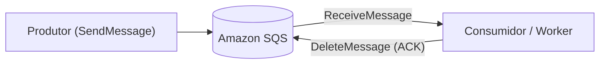
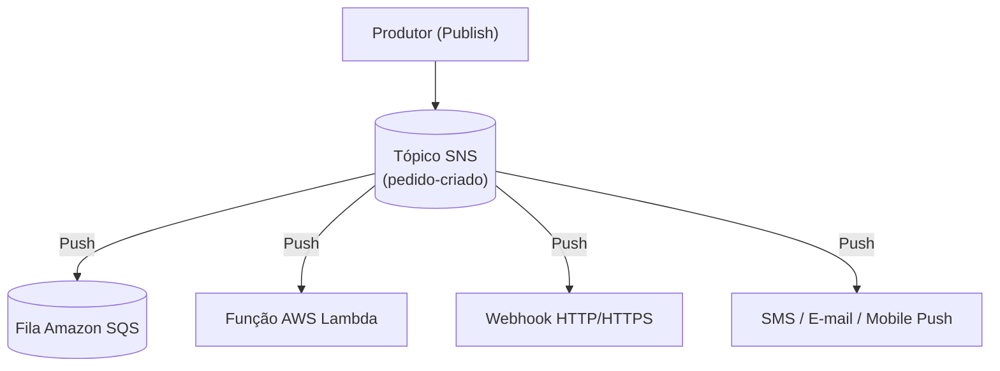
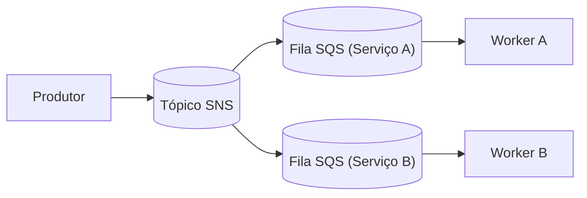
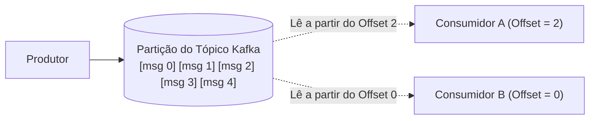

# Guia dos Serviços AWS: SQS, SNS e Kafka (Amazon MSK)

> [!NOTE]
> Este guia traz o aprofundamento técnico sobre os três pilares citados no título da palestra do **AWS Community Day**, detalhando o funcionamento interno de cada serviço, seus parâmetros vitais e como eles se comparam.

---

## 1. Amazon SQS (Simple Queue Service)

Lançado em 2004, o **Amazon SQS** foi o primeiro serviço disponível comercialmente pela AWS. É uma fila de mensagens totalmente gerenciada, escalável e *serverless*.



### 1.1. SQS Standard vs SQS FIFO

| Característica | SQS Standard (Padrão) | SQS FIFO (First-In, First-Out) |
| :--- | :--- | :--- |
| **Vazão (*Throughput*)** | **Quase ilimitada** (milhares/milhões de msgs/s) | Até 300 msgs/s (ou até 3.000 msgs/s com batching / high throughput) |
| **Garantia de Entrega** | **At-Least-Once** (pode entregar duplicadas) | **Exactly-Once** (deduplicação automática) |
| **Garantia de Ordem** | Melhor esforço (*Best-effort ordering*) | **Ordem Estrita Garantida** por grupo |
| **Sufixo do Nome** | Nome livre (ex.: `pedidos-processamento`) | Obrigatório terminar em `.fifo` (ex.: `pedidos.fifo`) |
| **Mecanismo de Controle** | Nenhum atributo especial obrigatório | Exige `MessageGroupId` e `MessageDeduplicationId` |

> [!TIP]
> **Regra Prática de Engenharia:** Na maioria dos cenários de microsserviços, prefira **SQS Standard** combinado com **Consumidores Idempotentes**. Use **SQS FIFO** apenas quando a regra de negócio for intransigente com ordem estrita e sua vazão estiver dentro do limite de transações por segundo.

### 1.2. Parâmetros Críticos do SQS que Todo Engenheiro Deve Conhecer

#### A. Visibility Timeout (Tempo de Visibilidade)
Quando um worker executa uma chamada `ReceiveMessage`, a mensagem não sai da fila. Ela entra em um estado **invisível** durante o período configurado (padrão: 30 segundos).
- **Se o worker terminar o trabalho:** Ele chama `DeleteMessage`. A mensagem é apagada em definitivo.
- **Se o worker morrer ou demorar demais:** O *Visibility Timeout* expira e a mensagem volta a ficar visível para outros workers processarem.
- **Atenção:** Se sua tarefa leva 45 segundos para rodar e o seu Visibility Timeout for de 30 segundos, outro worker pegará a mesma mensagem enquanto o primeiro ainda a está processando! Ajuste o timeout ou use a API `ChangeMessageVisibility` para estender o prazo.

#### B. Long Polling vs Short Polling
- **Short Polling (`WaitTimeSeconds = 0`):** O SQS consulta apenas um subconjunto de seus servidores de armazenamento e responde imediatamente, mesmo se a fila estiver vazia. Isso gera milhões de chamadas desnecessárias e encarece sua fatura da AWS!
- **Long Polling (`WaitTimeSeconds = 20`):** A chamada fica aguardando até 20 segundos para que uma mensagem chegue antes de responder vazio. **Economiza até 90% em custos de requisição** e reduz a latência percebida.

#### C. Redrive Policy e Dead Letter Queue (DLQ)
Configura o que fazer quando uma mensagem falha:
- `maxReceiveCount`: Número máximo de vezes que a mensagem pode ser recebida e não confirmada (ex.: 3 a 5 tentativas).
- Ao atingir o limite, o próprio SQS move a mensagem automaticamente para a fila de descarte (DLQ), impedindo que mensagens com formato inválido travem os seus workers.

---

## 2. Amazon SNS (Simple Notification Service)

O **Amazon SNS** é um serviço de publicação e assinatura (*Pub/Sub*) do tipo *Push*: o emissor publica a mensagem em um **Tópico SNS**, e o SNS a entrega imediatamente a todos os destinos assinados.



### 2.1. O Padrão Canônico da AWS: SNS + SQS Fanout

Por que nunca devemos conectar o produtor diretamente a múltiplos serviços síncronos se podemos usar SNS + SQS?



**Por que este é o padrão mais recomendado da AWS?**
1. **Desacoplamento Completo:** O produtor não conhece nenhum consumidor.
2. **Buffer Individual:** Se o Serviço B ficar fora do ar por 2 horas, a Fila SQS B acumula as mensagens sem afetar o Serviço A nem o SNS.
3. **Controle de Vazão Próprio:** Cada serviço drena sua fila na velocidade ideal para seu próprio banco de dados.

### 2.2. Políticas de Filtragem (Subscription Filter Policies)
Por padrão, o assinante recebe todas as mensagens enviadas ao tópico. No entanto, o SNS permite configurar filtros JSON baseados nos atributos da mensagem:
```json
{
  "tipoCliente": ["VIP", "CORPORATIVO"],
  "valorTotal": [{"numeric": [">=", 1000]}]
}
```
Com isso, o SNS só entrega a mensagem para a fila do time corporativo se o pedido atender àquelas condições, evitando processamento inútil no consumidor.

---

## 3. Apache Kafka e Amazon MSK (Managed Streaming for Apache Kafka)

O **Apache Kafka** não é um broker de filas como o SQS; ele é uma **plataforma de streaming de eventos distribuída e persistente baseada em logs append-only**.



### 3.1. Conceitos Fundamentais do Kafka
- **Log Append-Only:** Eventos só podem ser adicionados no final. Uma mensagem nunca é alterada nem deletada após a leitura.
- **Partições:** Cada tópico é dividido em partições. Mensagens com a mesma `Partition Key` caem na mesma partição e têm **ordem garantida**.
- **Offset:** Um número inteiro sequencial que indica a posição de cada mensagem na partição. O consumidor guarda qual offset já leu.
- **Retenção:** As mensagens ficam salvas por tempo (ex.: 7 dias) ou por tamanho em disco, permitindo que qualquer consumidor faça **Replay** (voltar no tempo e reler os dados).

### 3.2. O Que é o Amazon MSK?
Gerenciar um cluster Kafka manualmente em instâncias EC2 exige:
- Configurar e operar clusters ZooKeeper / nós de controle KRaft.
- Monitorar espaço em disco de cada broker e balancear partições manualmente.
- Aplicar patches de segurança e configurar replicação multi-zona.

O **Amazon MSK** resolve isso:
- A AWS cuida do provisionamento, saúde dos brokers e alta disponibilidade em 3 Zonas de Disponibilidade (Multi-AZ).
- Integração nativa com **AWS IAM** para autenticação e autorização segura.
- Oferece duas modalidades:
  - **MSK Provisioned:** Você escolhe o tipo de instância dos brokers (ex.: `kafka.m5.large`) e define a capacidade.
  - **MSK Serverless:** Ajusta automaticamente a capacidade de streaming com base no tráfego, sem gerenciar instâncias.

---

## 4. Matriz Comparativa Definitiva: SQS vs SNS vs Amazon MSK

| Critério | Amazon SQS | Amazon SNS | Amazon MSK (Kafka) |
| :--- | :--- | :--- | :--- |
| **Modelo Principal** | Fila de Mensagens (*Pull*) | Publicação/Assinatura (*Push*) | Log Distribuído de Eventos (*Pull Streaming*) |
| **Comportamento Pós-Consumo** | Mensagem é **deletada** após o processamento | Mensagem é descartada após entrega aos assinantes | Mensagens são **retidas no log** (imutáveis por dias/anos) |
| **Capacidade de Replay** | ❌ Não existe | ❌ Não existe | ✅ Sim (basta retroceder o Offset) |
| **Ordenação** | Best-effort (Standard) ou Estrita (FIFO até 3k/s) | Não ordenada (Standard) ou FIFO Topic | Ordem estrita por **Chave de Partição** |
| **Throughput / Vazão** | Quase ilimitado (Standard) | Praticamente ilimitado | Milhões de eventos por segundo |
| **Esforço Operacional** | Zero (*Serverless*) | Zero (*Serverless*) | Médio (Provisioned) ou Baixo (Serverless) |
| **Custo de Entrada** | Gratuito até 1 milhão de requisições/mês | Gratuito até 1 milhão de requisições/mês | Custo mínimo de infraestrutura maior por cluster |
| **Melhor Caso de Uso** | Background jobs, tarefas assíncronas pontuais, desacoplamento simples | Fanout para múltiplos serviços, notificações imediatas | Rastreamento de cliques, telemetria em tempo real, CDC, Event Sourcing |
