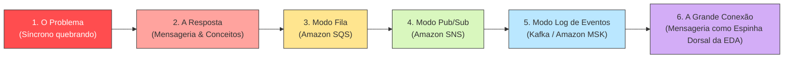

# 🎙️ Preparação para a Palestra: AWS Community Day

> **Tema:** Primeiros Passos em Mensageria: SQS, SNS, Kafka e o Mundo dos Eventos  
> **Formato:** Apresentação em trio (3 palestrantes)  
> **Duração Estimada:** 40 a 45 minutos (+ 5 minutos para Q&A da plateia)  
> **Nível:** Introdutório / Intermediário (foco conceitual com exemplos práticos e arquitetura na AWS)

---

## 🎯 Objetivo da Palestra

Desmistificar o universo de mensageria para a comunidade de desenvolvedores e arquitetos, conduzindo a plateia por uma jornada evolutiva: desde a dor das integrações síncronas tradicionais até a maturidade das Arquiteturas Orientadas a Eventos (EDA), contextualizando quando utilizar **Amazon SQS**, **Amazon SNS** e **Apache Kafka / Amazon MSK**.

---

## 🗺️ Mapa da Jornada da Apresentação

---

## 👥 Estratégia de Divisão entre os 3 Palestrantes

Para que a apresentação em trio seja dinâmica e não pareça três palestras desconexas, cada palestrante assume um ato específico de uma **história contínua** (o caso da *TechStore Nuvem*):

| Bloco | Palestrante | Tempo Aprox. | Foco Temático e Serviços |
| :---: | :---: | :---: | :--- |
| **Ato 1** | **Palestrante 1** | ~12 min | **A Dor Síncrona e o Despertar da Mensageria:** • O exemplo do e-commerce quebrando na promoção (HTTP em cascata, timeout, cascading failures). • O que é mensageria e seus benefícios (desacoplamento, resiliência, buffering). • Anatomia essencial da mensagem e os atores (Produtor, Broker, Consumidor). |
| **Ato 2** | **Palestrante 2** | ~15 min | **O Modo Fila e o Modo Pub/Sub na AWS:** • Modo Fila com **Amazon SQS** (Standard vs FIFO, Visibility Timeout, DLQ). • Modo Pub/Sub com **Amazon SNS** (Tópicos, Fanout SNS $\rightarrow$ SQS, Filtros). • Resolução prática do problema da loja com SQS e SNS. |
| **Ato 3** | **Palestrante 3** | ~13 min | **O Log de Eventos e a Visão de Futuro (EDA):** • Por que filas não resolvem tudo? A necessidade de histórico, replay e streaming. • Modo Log de Eventos com **Apache Kafka e Amazon MSK** (Partições, Offsets, imutabilidade). • Introdução à EDA: Mensageria como a espinha dorsal dos sistemas modernos. • Fechamento, dicas finais e chamada para Q&A. |

---

## 📂 Materiais Deste Kit de Preparação

1. [**01. Roteiro Slide a Slide e Transições**](./01-roteiro-e-slides.md)  
   Estrutura de 20 slides pronta para montagem da apresentação, com pontos de fala (*talking points*), ganchos de passagem de bastão entre os palestrantes e armadilhas a evitar no palco.

2. [**02. O Estudo de Caso Guia: TechStore Nuvem**](./02-estudo-de-caso-loja-nuvem.md)  
   O exemplo visual unificado do e-commerce que evolui ao longo dos slides para prender a atenção da plateia do início ao fim.

3. [**03. Guia Prático dos Serviços: SQS, SNS e Kafka (MSK)**](./03-guia-aws-sqs-sns-msk.md)  
   Foco aprofundado nos três serviços do título da palestra, comparativos lado a lado e quando escolher cada um.

4. [**04. Analogias Memoráveis de Palco e FAQ da Plateia**](./04-analogias-e-faq-plateia.md)  
   Metáforas fáceis de assimilar para o palco e preparação com respostas prontas para perguntas difíceis que a plateia do AWS Community Day costuma fazer.
